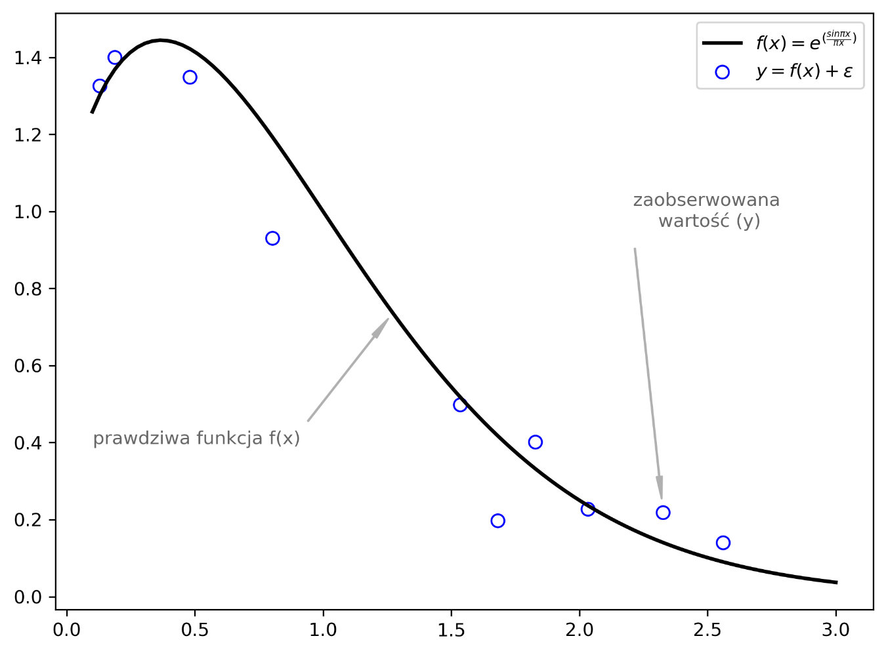
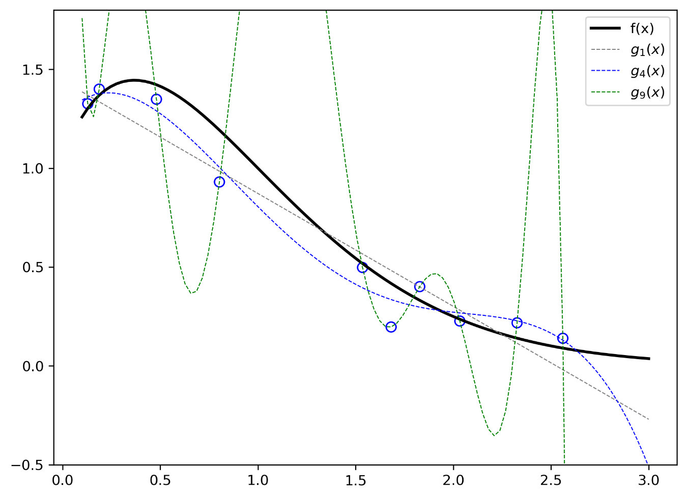
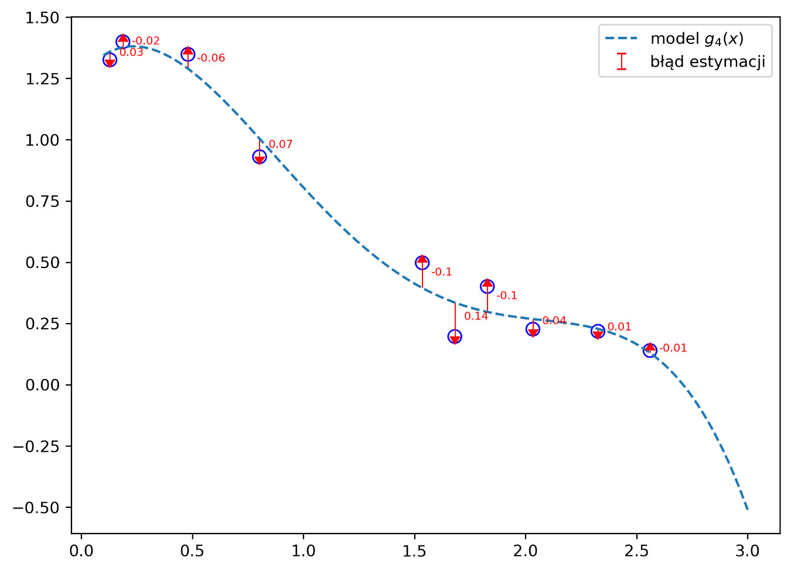
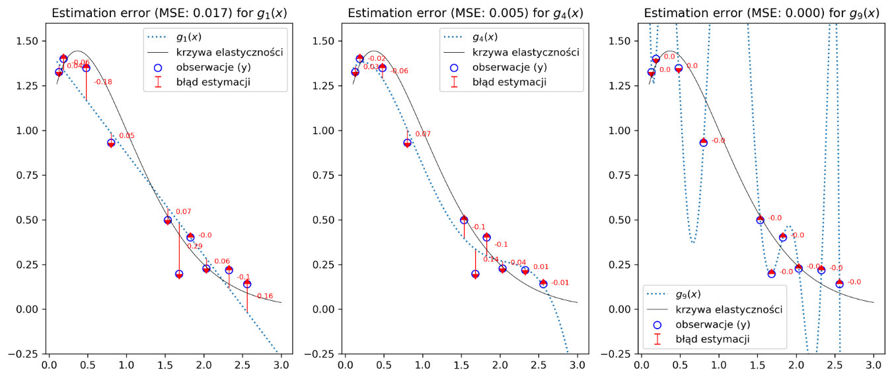
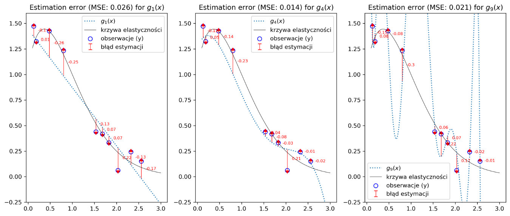
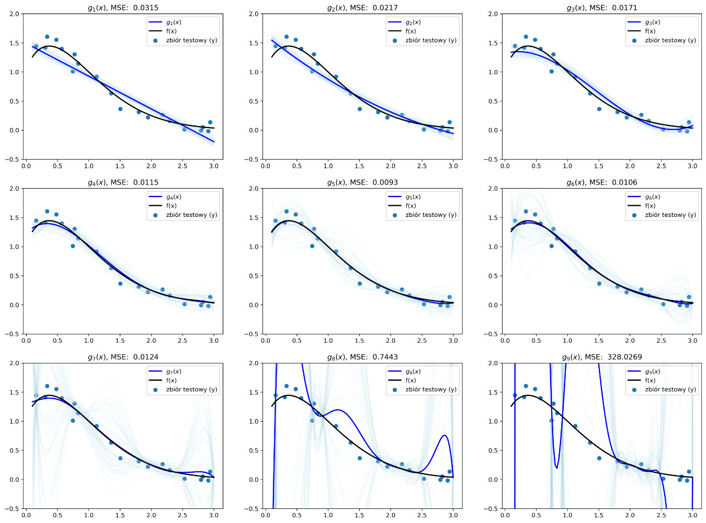
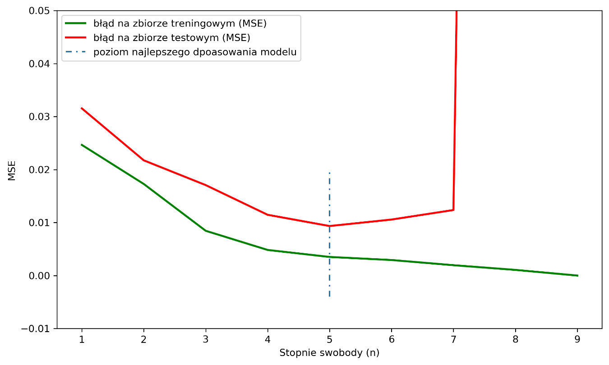
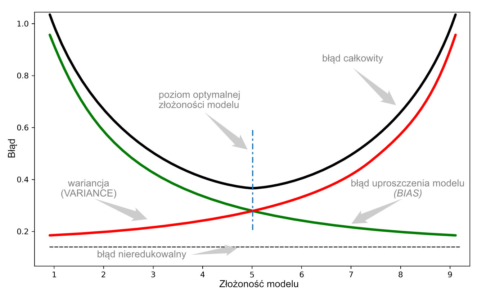

### Perhaps it never happened. Nowhere... 
> The soothing aroma of freshly brewed coffee, which peeked tentatively into ever-further nooks and crannies of the quiet control room, heralded the start of a very quiet night shift at the Berlin Christmas ornament factory. Oscar sat in his comfortable, soft armchair and gazed serenely at the green dots moving across the graph on one of the central monitors. 'A fairy tale,' he thought, glancing at the other displays in passing - a few more hours and the weekend. The sharp sound of the phone suddenly coming from the camera on the desk now seemed to him something incredibly ridiculous. He hesitated a moment before answering. 'Oscar, we've got a problem down here,' squawked an impatient voice in the receiver, 'something's gone wrong with the mix. The moulds for the dwarfs are starting to crack. 'That's not possible,' thought Oscar, 'our latest control model can catch every parameter deviation.' An unpleasant screeching started coming from behind him. The first red spots appeared on the central screen....

At first glance, the bewilderment of Oscar, the protagonist of the introduction to this post, seems perfectly natural. After all, a perfectly trained model in the control module must ensure that the production line works optimally and correctly. However, something is wrong. More precisely, imperfect is ... the perfection of this model. Note Oscar's first thought was: "the model can catch ALL parameter deviations". What could this mean?  

Consider for a moment the essence of this problem at a more general level. Machine learning models must, as closely as possible, reflect the true nature of the phenomena they model. As is well known, we can define many phenomena (if not all...) as an approximate realisation of some function $f(x)$, transforming selected sets of variables into values we observe. For example, we can express sales a function reflecting the amount of advertising expenditure into the corresponding revenue from the sale of the promoted product (of course, only within a certain range of spending and for a limited time). Another example would be a function reflecting the dependence of a car's stopping distance on the travelling speed. At the level of intuition, anyone can ascertain the existence of many such constant dependencies (functions) in the surrounding world. Having a set of observations, consisting of values assigned to specific variables, we can try to find the function $f(x)$ shaping this set. To simplify the problem, we will use a model based on *regression analysis*.  

### Simple regression model
The essence of how regression models work boils down to the search for a relationship that characterises the variability of the phenomenon under study. In other words, we are trying to find a specific "formula" (our function $f(x)$) that transforms the studied variable *x* (often called the *explanatory* variable or *independent* variable) into a corresponding value *y* (called the *explained* variable or *dependent* variable). In the previously mentioned examples, the explanatory variables are the amount of advertising effort and vehicle speed, and the explanatory variables are sales volume and braking distance. Concluding, we can write the above relationships in the form $y = f(x)$. That is how it looks, at least in theory. Reality brings us a slightly different, more "noisy" picture. In practice, every observation is subject to some error, which "carries" it randomly from the path represented by the function $f(x)$. Very generally, we can write this phenomenon as follows:  


$$
y = f(x) + \epsilon
$$ 

where $\epsilon$ is an irreducible error, which can derive its source from a strain of causes, such as the presence of factors affecting the explanatory variable *y* but not dependent on *x*. The $\epsilon$ is assumed to be random, with a normal distribution, thus characteristic of many phenomena in the surrounding world. This distribution is characterised by a variance $\sigma_{\epsilon}^2$ and a mean equal to 0 (which can be written as follows: $\epsilon \sim N(0, \sigma_{\epsilon}^2)$. It is worth noting that the random nature of the $\epsilon$ error directly affects the *y* variable by making the latter also have a random variation, except that its mean is further conditioned by $f(x)$. Using the **NumPy** library, we can generate a random variable $\epsilon$  with given parameters of the mean and standard deviation $\sigma_{\epsilon}$:

`np.random.normal(loc=0.0, scale=1.0, size=None)`

where: *loc* is the mean for the generated set, *scale* is the standard deviation and *size* corresponds to the sample size. The following code will set up and draw an example of a random set characteristic of the $\epsilon$ error in question:  

```python lineNumbers
import numpy as np
from numpy.polynomial import polynomial as pnml

import matplotlib.pyplot as plt
import seaborn as sns
from collections import defaultdict
import math

#generujemy zbiór 200 liczb losowych o średniej=0 i odchyleniu standardowym=1
epsilon = np.random.normal(loc=0, scale=1, size=200) 

#rysujemy wykres przedstawiający zobaczyć właściwości losowego zbioru
plt.subplots(figsize=(10, 8))
plt.subplot(211, title=f'Wykres liniowy dla losowych {SIZE} próbek o rozkładzie $N(0, \sigma_{{\epsilon}}^2$)')
plt.plot(np.arange(len(epsilon)), epsilon, label='błąd losowy ($\epsilon$)')
plt.axhline(np.mean(epsilon), color = 'black', linestyle=':', label='wartość średnia')
plt.legend()
plt.subplot(212, title='Histogram oraz funkcja gęstości rozkładu dla zbioru wartości $\epsilon$')
sns.distplot(epsilon)
plt.show()
```  
<figcaption>The graph vividly illustrates the nature of the error ('noise') in data. The top drawing shows a large spontaneity in the skewness of the individual values, around the mean (equal to zero) marked with a black dotted line. The bottom figure, which shows the histogram, clearly indicates that we are dealing with a set with a normal probability distribution. Understanding this will slowly help us get through the rest of the material more easily.</figcaption>

We have started with the most 'chaotic' component of the phenomenon. It is time for us to look at the other correlations. For this, let us return to the problem faced by Oskar. On that fateful evening, he received information that there was a serious problem with the durability of the moulds. The model, which had recently been implemented into the factory's manufacturing process, was supposed to control the raw material composition of the mix, or more precisely two, of its rather unstable components, affecting the flexibility of the final product. Our editors did not get to the composition details of the mix analysed by the model at the factory because, as suggested, they are a 'factory secret'. Therefore, for the sake of further analysis, let us assume that there is a certain relationship in the production process (called the 'elasticity curve' by the engineers at the factory). In its definition it has an exponential function with a logarithmically varying exponent (remember that it is usually the case that the true shape of the function f(x) is not known to us). We know from earlier considerations that $y=f(x) + \epsilon$. Then, each of our observations will be an outcome of the following relation:

$$
y =e^{x*log(\frac{1}{x})} + \mathcal{N}(0, \sigma_{\epsilon}^2)
$$

The example will become clearer when we draw our function:
```python lineNumbers
def elasticity_curve(x):
    '''
    Zwaraca wartości funkcji f(x) = e^(x*ln(1/x)) dla podanych argumentów x
    '''
    assert all(x > 0), 'dziedziną funkcji f(x) jest zbór liczb rzeczywistych, większych od 0'
    return np.exp(x*np.log(1/x))

def get_random_sample(x, size, seed=None):
    '''
    Losowo wybiera próbkę o rozmiarze "size" ze zbioru "x"
    ''' 
    np.random.seed(seed)
    assert len(x) >= size, f'Wielkość próbki (size: {size}) przekracza wielkość zbioru (x: {len(x)})'
    
    t = [True] * size + [False] * (len(x)-size)
    np.random.shuffle(t)
    return np.array(x)[t]

def get_true_y(x, func, scale = 0.1, seed = None):
    '''
    Symuluje rzeczywiste wartości próbki dla podanych argumentów "x" i funkcji "func"
    '''
    np.random.seed(seed)
    return func(x) + np.random.normal(size=x.shape[0], scale=scale)

number_of_samples = 10
SEED = 92

random_samples = get_random_sample(x, number_of_samples, seed=29)

y_true = get_true_y(random_samples, elasticity_curve, seed=SEED)
fig, ax = plt.subplots(figsize=(8, 6))

ax.scatter(random_samples, y_true, facecolor='none',
           color= 'blue', s=50, label='$y=f(x)+\\epsilon$')
ax.plot(x, elasticity_curve(x), linewidth=2, color='k', label='$f(x)=e^{(\\frac{sin\\pi x}{\\pi x})}$')

ax.annotate('prawdziwa funkcja f(x)', xy=(x[40], true_fun(x)[40]),  xycoords='data',
            xytext=(0.3, 0.3), textcoords='axes fraction', color='#666666',
            arrowprops=dict(facecolor='#b0b0b0', edgecolor='#b0b0b0', shrink=0.05, width=0.3, headwidth=3),
            horizontalalignment='right', verticalalignment='top')

ax.annotate('zaobserwowana \nwartość (y)', xy=(random_samples[int(len(random_samples) * 0.8)], y_true[int(len(random_samples) * 0.8)]),  xycoords='data',
            xytext=(0.8, 0.7), textcoords='axes fraction',color='#666666',
            arrowprops=dict(facecolor='#b0b0b0', edgecolor='#b0b0b0', shrink=0.05, width=.3, headwidth=3),
            horizontalalignment='center', verticalalignment='top')

plt.legend()
plt.show();
```   

  
<figcaption>On the graph, we see, indicated by the black line, the course of the essential function f(x) and the actual observations clustered around it as blue points. Since, in practice, we only have a set of measurements (i.e. we only have the data, we know little or nothing about the function), we need a model that can find the most general and authentic relationship (f(x)) between the data.</figcaption>

#### "I bend my body boldly...", or dance ero... erroneous!
For this example, we will try to find a solution to our problem (i.e. build a model) based on a simple model of a **polynomial** function with *n* degrees of freedom. The general form of such a polynomial function can is as follows:

$$
g_{n}(x) = \beta_{n}x^{n} + \beta_{n-1}x^{n-1}+\beta_{n-2}x^{n-2}+\dots+\beta_{2}x^{2}+\beta_{1}x+\beta_{0}
$$

The characteristic of such a polynomial function is its "elasticity", increasing with the number of *n* degrees of freedom. The higher the degree of the polynomial, the greater its variability. We can say that as the number *n* increases, it has a greater capacity to "bend". Most often, however, values of *n* greater than 5-6 are not used because for large values of *n*, the curve takes on rather "bizarre" shapes. We will see this in a moment, moreover. $beta_{n}$ are the actual coefficients that determine the effect of each of the estimators ($x^{n}, x^{n-1},\dots, x$) on the course of the function. We can estimate these using the method of least squares. For this, we will use the **polynomial** module available in the library and the *polyfit()* and *polyval()* functions contained therein:  

`np.polynomial.polynomial.polyfit(x, y, deg)`

The function *polyfit()* returns us the coefficients of $beta_n$ (*coefficients*) of a polynomial of given degree *n* (*deg*), representing the best fit to data with values equal to *y*, at the points determined by *x*. It uses, for this purpose, the aforementioned *method of least squares of error*. In other words, we obtain the coefficients of the polynomial that best approximates the function $f(x)$ characterising the relationship between *y* and *x* for n degrees of freedom.

`np.polynomial.polynomial.polyval(x, c)`

The function *polyval()* allows us to calculate the value of a polynomial with coefficients *c* (*c* is an array containing the coefficients of $g(x)$) at the points determined by *x*.

Let's see how the function $g(x)$ will fit our dataset depending on the degrees of freedom used:
```python lineNumbers
degrees_of_freedom = [1, 4, 9]
degree_color = ['gray','blue', 'green']
model_fit = {}

plt.subplots(figsize=(8, 6))
plt.plot(x, elasticity_curve(x), lw=2, color='k', label='f(x)')
plt.scatter(random_samples, y_true, facecolor='none', color= 'blue', s=50)

for model, degree in enumerate(degrees_of_freedom):
    model_fit[degree] = pnml.polyfit(random_samples, y_true, degree)
    plt.plot(x, pnml.polyval(x, model_fit[degree]), ls='--', color = degree_color[model], lw=.7, label=f'$g_{{{degree}}}(x)$')
   
plt.ylim(-0.5, 1.8)
plt.legend()
plt.show()
```


<figcaption>In the graph, you can see how the individual polynomials "behave" as a function of degree. Note that increasing "n" clearly affects the flexibility of the curve. For n = 1 (g<sub>1</sub> (x) - gray dashed line) you can see the rectilinear course of the function. In principle, we can say that the model tries to penetrate the centre of the cloud of points that make up the set of our observations. Increasing the degrees of freedom to 4 (g<sub>4</sub>(x), blue line) causes the curve to bend, trying to follow the elasticity curve more closely. When we further increase the value of *n* (g<sub>9</sub>(x), green curve), the function bends very much and hits almost every point of our actual observations. At the same time, its shape strongly tends toward regions where the probability of finding any observation is equal to zero (e.g. fragments of the curve extending beyond the visible area of the graph).</figcaption>

We can divide the models into three groups, depending on the degree to which they find the data:
 + $g_1(x)$ - a model that underestimates our observations is subject to considerable estimation error.
 + $g_9(x)$ - a model that perfectly finds the recorded observations (note that we are talking about fitting to the sample data and not to the actual function $f(x)$, i.e. the "elasticity curve"). One might give in to the temptation to say that the model is error-free.
 + $g_5(x)$ - a model that is not very flexible but tries to "get closer" to the observations, often missing the "point" and leaving some room for error.  

 We have talked a lot in this classification about the error. But what is it? From the perspective of our problem, we will call an error any situation in which the model makes a mistake in its estimation and incorrectly estimates the value of *y* for the parameter *x* given to it. In the simplest terms, it is the difference between the actual value of the observation and the value the model has estimated. Let us take the middle model, with four degrees of freedom, and see this in the figure:  
```python lineNumbers
degree = 4
y_pred = pnml.polyval(random_samples, model_fit[degree])
y_true = get_true_y(random_samples, elasticity_curve, seed=SEED)

#obliczamy błąd dla każdej pary: obserwacja i  wartość z modelu
y_err = y_pred - y_true

plt.figure(figsize=(8, 6))

plt.plot(x, pnml.polyval(x, model_fit[degree]), ls='--', label=f'model $g_{{{degree}}}(x)$')
plt.scatter(random_samples, y_true, facecolor='none', color= 'blue', s=70)
plt.errorbar(random_samples, y_pred, yerr=np.abs(y_err), uplims=y_err > 0, lolims=y_err < 0, fmt='none', linewidth=0.7, color='red', label='błąd estymacji')

for i, err in enumerate(y_err):
    plt.text(x=random_samples[i]+0.04, y = y_true[i] + (err/2), s=round(err, 2), fontdict={'size': 7, 'color': 'red'})
plt.legend()
plt.show()
```
  
<figcaption>The red arrows on the graph, pointing from the dashed estimation line (model) to the actual observation points (y), show how the model is wrong. The red value next to each point represents the error, i.e. the value by which the model overestimated or underestimated our observations. Let's see how this will look for the other models.</figcaption>

We will write some auxiliary functions to do this:  
```python lineNumbers
def mse(y_pred, y_true):
    '''Oblicza błąd średniokwadatowy (MSE)'''
    return np.mean((y_pred - y_true) ** 2)

def _filter(main_set, sub_set):
    '''Tworzy maskę logiczną (True, False) do filtorwana tablicy (main_set), jeśli posiada ona wartości tablicy (sub_set)'''
	return [True if any(itm == sub_set) else False for itm in main_set]

def plot_errors(x_train, x, y_true, y_preds, model_fits):
    '''Wizualizuje błąd modelu (model_fits) dla podanych predykcji (y_pred) oraz wartości rzeczywistych (y_true)
    '''
    plt.figure(figsize=(20, 6), dpi=300)
    for model, degree in enumerate(model_fits, 1):
        y_pred = y_preds[degree][_filter(x, random_samples)]
        y_err = y_pred - y_true
        plt.subplot(1, 4, model, title=f'Estimation error (MSE:{mse(y_pred, y_true): .3f}) for $g_{{{degree}}}(x)$')
        plt.scatter(random_samples, y_true, facecolor='none', color= 'blue', s=50, label='obserwacje (y)')
        plt.plot(x, y_preds[degree], ls=':', label=f'$g_{{{degree}}}(x)$')
        
        plt.errorbar(random_samples, y_pred, yerr=np.abs(y_err), uplims=y_err > 0, lolims=y_err < 0, fmt='none', linewidth=0.7, color='red', label='błąd estymacji')
        
        plt.plot(x, elasticity_curve(x), color='k', lw=.5, label='krzywa elastyczności')
        for i, err in enumerate(y_err):
            plt.text(x=random_samples[i] + 0.1, y = y_true[i] + (err/2), s=round(err, 2), fontdict={'size': 7, 'color': 'red'})
        plt.ylim(-0.25, 1.6)
        plt.legend()
    plt.show()
    return [True if any(itm == sub_set) else False for itm in main_set]
``` 
Let me draw your attention to the **mse()** function, which calculates the mean squared error. It is one of the elemental metrics used in machine learning to assess the quality of a model. Essentially, its operation boils down to counting the mean square of the deviations between the values model predicted (predictions) and the actual values.

Mathematically, we can write it down as follows:

$$
MSE = \frac{1}{n}\sum_{i=1}^{n}(\hat{y} - y)^2
$$

where: $\hat{y}$ is the value calculated by the model for a given variable *x*, while *y* is the actual observed value for that variable.  

The larger the value of this error, the worse the model behaves. If we run the code below, we can compare the behaviour of the three models, depending on the degrees of freedom (for *n=1*, *n=4*, *n=9*):  
```python lineNumbers
model_fits = {}
y_preds = {}
degrees_of_freedom = [1, 4, 9]

for degree in degrees_of_freedom:
    model_fits[degree] = pnml.polyfit(random_samples, y_true, degree)
    y_preds[degree] = pnml.polyval(x, model_fits[degree])
    
plot_errors(random_samples, x, y_true, y_preds, model_fits)
```  
  
<figcaption>From the analysis of these graphs, it is clear that the best model is the one based on the highest degree polynomial (9). The model's prediction line passes almost exactly through every point, and the MSE value is zero. One could say that the model is perfect. But is it really so?</figcaption>

Remember that the model has been "tuned" for a specific dataset. Let's call it the training set for simplicity. What happens when we use the model thus built for another dataset that the model has not yet seen (let's call it the test set)? We generate a new test set and check:   

```python lineNumbers
y_true = get_true_y(random_samples, elasticity_curve, seed=7)
plot_errors(random_samples, x, y_true, y_preds, model_fits)
```

  
<figcaption>And here is a little surprise. The base model (n=1) increased its error slightly, i.e. it is wrong just as much. The same happened for the middle model (n=4), where the MSE error was slightly more considerable. On the other hand, our "perfect" model (n=9) performed terribly. The value of the mean squared error was much more extensive than the middle model (n=4) and almost matched the base model.</figcaption>  

What then went wrong? Well... in principle, everything is fine. We will analyse the above results for each case separately:  
+ The basic model (*n=1*) already had a high error during training. It was due to its low flexibility and limited ability to fit the data. Consequently, it incorrectly estimates values for the test set. In such a situation, we say the model has a high bias. We are dealing with the **underfitting** of the model.
+ The most flexible model (*n=9*) handled the training set perfectly. It found each observation almost without error. Unfortunately, the problem arose when we used the test set. The perfect fit to the previous data set meant that its estimation for the new data was very far from perfect. In such a case, we can say that the model has a very high sensitivity to change in the data (**high variance**), and we are dealing with **overfitting**.
+ Finally, the middle model (*n=4*). Although its performance after the training session was worse than the "perfect" model, we did not notice as big a jump in error as we had with its "flexible" competitor in the test session. The optimum degree of flexibility provided it with a high degree of generalisability, which, in practice, means that the model does not strongly follow each observation it encounters but tries to find a kind of "golden mean". In practice, it is the most desirable situation.  

#### Practice makes perfect
There remains another issue to investigate. We used a very narrow observation space to test the behaviour of the selected three models. Our data have a random variation in their characteristics. It means we should check how the models behave when confronted with more training data (e.g. 50 samples) per model. Let's not limit ourselves to just three selected models this time. Let's see what the averaged results look like for all polynomials from 1 to 9 degrees of freedom and how they compare with the new test data:  
```python lineNumbers
x_rand = get_random_sample(x, 10)
x_test = get_random_sample(x, 20)
y_test = get_true_y(x_test, elasticity_curve)

model_preds = defaultdict(list)
error_train = defaultdict(list)
error_test = defaultdict(list)

degrees_of_freedom = [1,2, 3, 4, 5, 6, 7, 8, 9]

fig, ax = plt.subplots(3, 3, figsize=(20, 15))

for model, degree in enumerate(degrees_of_freedom):
    plt.sca(ax[model // 3][model % 3])
    err = []
    for fitting_pass in range(50):
        y_true = get_true_y(x_rand, elasticity_curve)

        while(any(_filter(y_test, y_true))):
            y_true = get_true_y(x_rand, elasticity_curve)

        y_pred = pnml.polyval(x, pnml.polyfit(x_rand, y_true, degree))
        plt.plot(x, y_pred, color='lightblue', alpha=.1)
        err.append(mse(y_pred[_filter(x, x_rand)], y_true))
        model_preds[degree].append(y_pred)
    error_train[degree] = np.mean(err)

    model_avg_pred = np.mean(model_preds[degree], axis=0)
    error_test[degree] = mse(y_test, model_avg_pred[_filter(x, x_test)])

    plt.title(f'$g_{{{degree}}}(x)$, MSE: {error_test[degree]: .4f}')
    plt.scatter(x_test, y_test)
    plt.plot(x, model_avg_pred, color='blue', lw=2, label=f'$g_{{{degree}}}(x)$')
    plt.plot(x, true_fun(x), color='k', lw=2, label='f(x)')
    plt.ylim(-0.5, 2)
    plt.legend()
```  
  
<figcaption>I don't think this view surprises you at all (remember that you may get slightly different graphs as we generate randomly varying data). Initially, you see how, as the complexity of the model increases (i.e. increasing degrees of freedom), it fits the training data (decreasing error, decreasing bias), reaching its optimal shape around n=5. Further increasing the degree of the polynomial causes the MSE error to increase, indicating that the quality of the model is deteriorating. Overtraining is occurring.</figcaption>

To get a better idea of this, let's make another graph in which we plot the dependence of the training and testing error on the level of complexity of the model:  
```python lineNumbers
plt.figure(figsize=(10, 6), dpi=300)
plt.plot(degrees_of_freedom, [float(y) for y in error_train.values()], color='green', lw=2, label='błąd na zbiorze treningowym (MSE)')
plt.plot(degrees_of_freedom, [float(y) for y in error_test.values()], color='red', lw=2, label='błąd na zbiorze testowym (MSE)')
plt.axvline(np.argmin([float(y) for y in error_test.values()])+1, ls=(0, (4, 3, 1, 3)), ymin=0.1, ymax=0.5, label='poziom najlepszego dpoasowania modelu')
plt.ylim(-0.01, 0.05)
plt.xlabel('Stopnie swobody (n)')
plt.ylabel('MSE')
plt.legend()
``` 
  
<figcaption>The graph illustrates something like a learning curve (although classically, it should be the dependence of the error on, for example, the number of iterations). The most optimal situation for us is one in which, with decreasing training error, the test error has a minimum value. Note that the green curve representing the error for the training set continually decreases as a function of model complexity.</figcaption>

Our model is learning more and more. Relying only on the training data will not allow us to find the right optimum. We simultaneously observe the model's behaviour for the test set (red line). We notice the model starts to deteriorate in its predictive ability above the 5th degree of freedom (the model overtrains). A simple conclusion flows from this - the optimal level of model complexity is 5.  

However, one question remains. Actually, why does this happen? To explain this, we will need a bit of mathematics.

#### The queen of science gets in on the dancefloor
It turns out (and I hope you will forgive me for leaving this, at this point, unproven) that the expected value of the *MSE* error for the test set derives its source from three other statistical quantities. Specifically? If we denote by $x_0$ a particular value of the variable *x* from the test set and by $y_0$ the corresponding value of *y* from the same batch, we can write:

$$
\mathbb{E}\bigl(g(x_0) - y_0\bigr)^2 = Var\bigl(g(x_0)\bigr) + \bigl[Bias(g(x_0))\bigr]^2 + Var(\epsilon)
$$

In other words, the expected value of the *MSE* error for the variable $x_0$ from the test set ($\mathbb{E}\bigl(g(x_0) - y_0\bigr)^2$) is equal to the sum of the variance of the model estimate for the variable $x_0$ ($Var(Bias(g(x_0)\bigr)$), the square of the estimation error ($\bigl[Bias(g(x_0))\bigr]^2$) and the variance of the irreducible error ($Var(\epsilon)$). Let's write it down another way:  

$$
\mathbb{E}\bigl(g(x_0) - y_0\bigr)^2 = \mathbb{E}\bigl[(g(x_0) - \mathbb{E}[g(x)])^2\bigr ] +\bigl(\mathbb{E}[ g(x_0)] - y_0\bigr )^2+ \mathbb{E}\bigl[(y_0 - f(x_0))^2\bigr ]
$$

How can this equation be interpreted? The magnitude of the error depends on basically two "competing" quantities:
+ variance: $\mathbb{E}\bigl[(g(x_0) - \mathbb{E}[g(x)])^2\bigr]$, which is a measure of some sensitivity of the model to a change in the data. In other words, we can assume that this is the amount by which the estimate $g(x)$ will change when we test the model on new data. Ideally, this quantity should not change. You can observe the variance behaviour in the nine graphs we drew earlier. It is represented by the pale blue lines accompanying the main blue line of the model. For simple models (*n=1* or *n=2*), the level of variation (fluctuation) of these lines is small. However, it increases as the complexity of the model increases, eventually forming truly "exotic" shapes for *n=8* or *n=9*. It exists because the estimator strongly follows the observations from the set, so even a small change in the set causes a large change in the value of the estimator.
+ The inaccuracy of the model in reproducing the actual distribution of observations in the set is represented by the estimation error (*bias<sup>2</sup>*) of the model $bigl(\mathbb{E}[g(x_0)] - y_0\bigr )^2$. It is, in some simplification, a measure showing by how much a simple model (*n=1*, *n=2*) is wrong in becoming a fit to the variables in the set. We see straight lines on the graph, trying, as it were, to get through the middle of the cloud of observations, eventually making them somewhere close to each of them but far enough away that it is difficult to talk about accuracy. As the model complexity increases, so does its flexibility. Finally, its ability to approximate the estimation values grows (reducing the distance between the prediction and the actual values in the set). It results in a decreasing error.
I have not mentioned the third parameter, which is the variance of the irreducible error. In the initial analyses of this blog post, I assumed that the data error is random with the characteristics of a normal distribution, i.e. $Var(\epsilon}(0, \epsigma_{\epsilon}^2)$. Since $Var(\epsilon) = \sigma_{\epsilon}^2$, I can assume that it has a constant value. Furthermore, it is worth noting that both $Var(g(x_0)\epsilon}^2$ and $Var[Bias(g(x_0))\epsilon}^2$ are not less than 0, so the model general error (MSE) will never be less than $Var(\epsilon}^2$.  

#### Because you need a compromise

As a friend of mine used to say - when I draw something myself, I start to understand it better. The diagram below shows a theoretical and simplified diagram of the relationship between the quantities described:

  
<figcaption>As you can see, fine-tuning a model is an art of finding a compromise (<strong>trade-off</strong>). Although at first, it seemed that the ideal model was one that could predict values perfectly, we have seen how far from expectations such reasoning can be.</figcaption>

And it was precisely this balance missing from the model which was supposed to support Oskar (you may still remember him from the introduction to this post :)). Someone just forgot about it...  

As an aside, I would add that the mechanism described here for the relationship between model complexity and its ability to generalise prediction is specific to "classical" machine learning. In the case of neural networks and deep learning, there are methods to reduce estimation errors and do not necessarily condemn the model to the curse of overfitting. But that's a story for a completely different tale :)


