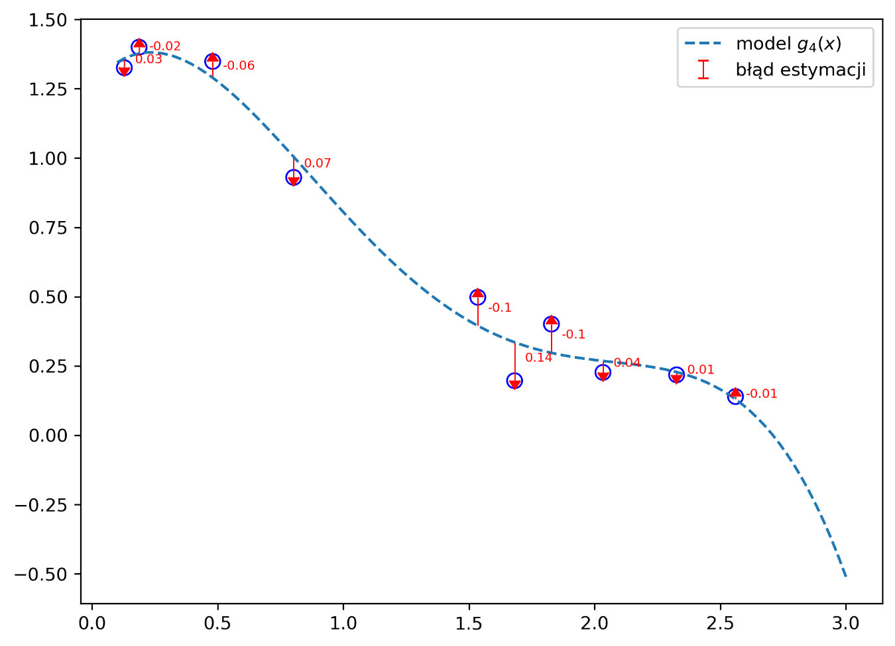
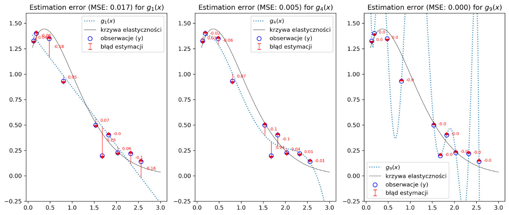
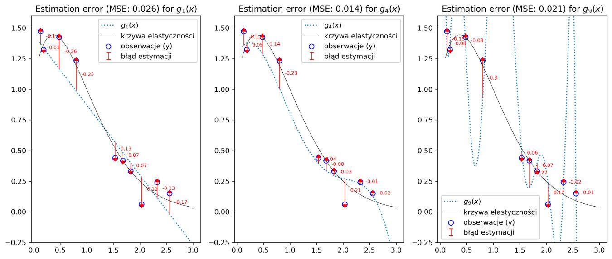

### Być może to nie wydarzyło się nigdy. Nigdzie...  

> Kojący aromat świeżo parzonej kawy, który nieśmiało zaglądał do coraz dalszych zakamarków wyciszonej sterowni, zapowiadał początek bardzo spokojnej, nocnej zmiany w berlińskiej fabryce ozdób świątecznych. Oscar siedział w swoim wygodnym, miękkim fotelu i ze spokojem wpatrywał się w zielone punkty, przemieszczające się w poprzek wykresu na jednym z centralnych monitorów. Bajka - pomyślał spoglądając od niechcenia na pozostałe wyświetlacze - jescze kilka godzin i weekend. Ostry dźwięk telefonu, który nagle wydobył się ze stojącego na biurku aparatu, wydał mu się teraz czymś niesamowicie niedorzecznym. Zwlekał chwilę zanim odebrał. Oscar, mamy tu na dole problem - skrzeczał zniecierpliwony głos w słuchawce - coś się stało z mieszanką. Formy do krasnali zaczynają pękać. To niemożliwe - pomyślał Oscar - nasz ostatni model kontroli potrafi wyłapać dosłownie wszystkie odchylenia parametrów. Zza jego pleców zaczęły dobiegać nieprzyjemne piski. Na centralnym ekranie pojawiły się pierwsze czerwone plamki...  

Na pierwszy rzut oka, zdumienie Oscar'a, bohatera wstępu do tego posta, wydaje się być zupełnie naturalne. Przecież doskonale wytrenowany model w module kontrolnym, musi zapewnić optymalną i prawidłową pracę linii produkcyjnej. Coś jest jednak nie tak. A dokładnie, niedoskonała jest... doskonałość tego modelu. Zwróć uwagę jaka była pierwsza myśl Oskara: "model potrafi wyłapać WSZYSTKIE odchylenia parametrów". Co to może oznaczać?  

Zastanów się przez chwilę nad istotą tego problemu na bardziej ogólnym poziomie. Modele uczenia maszynowego muszą, w możliwe najwierniejszy sposób, odzwierciedlać prawdziwą naturę zjawisk, które modelują. Jak wiadomo wiele zjawisk (jeśli nie wszystkie...) możemy zdefiniować jako przybliżoną realizację pewnej funkcji $f(x)$, przekształcającej wybrane zbiory zmiennych w obserwowane przez nas wartości. Na przykład sprzedaż może być wyrażona jako funkcja odzwierciedlająca wielkość wydatków na reklamę w odpowiadający im przychód ze sprzedaży promowanego produktu (oczywiście tylko w pewnym zakresie wydatków i w ograniczonym czasie). Innym przykładem niech będzie funkcja odzwierciedlająca zależność długości drogi hamowania samochodu od prędkości z jaką się poruszał. Już na poziomie intuicji każdy może stwierdzić fakt istnienia wielu takich stałych zależności (funkcji) w otaczającym świecie. Posiadając zbiór obserwacji, składający się z przyporządkowanych określonym zmiennym wartości, możemy spróbować odnaleźć funkcję $f(x)$ kształtującą ten zbiór. Dla uproszczenia problemu, wykorzystamy do tego model oparty o *analizę regresji*.  

### Prosty model regresyjny  
Istota działania modeli regresyjnych sprowadza się do poszukiwania zależności, charakteryzującej zmienność badanego zjawiska. Inaczej mówiąc próbujemy odnaleźć pewien "wzór" (czyli naszą funkcję $f(x)$), który przekształca badaną zmienną *x* (nazywaną często zmienną *objaśniającą* lub zmienną *niezależną*) w odpowiadającą jej wartość *y* (zwaną zmienną *objaśnianą* lub zmienną *zależną*). Odwołując się do wspomnianych wcześniej przykładów, zmiennymi objaśniającymi są wielkość nakładów na reklamę i prędkość pojazdu a zmiennymi objaśnianymi zaś wielkość sprzedaży oraz droga hamowania. Uogólniając możemy powyższe zależności zapisać w postaci $y = f(x)$. Tak to wygląda przynajmniej w teorii. Rzeczywistość przynosi nam nieco inny, bardziej "zaszumiony" obraz. W praktyce bowiem, każda obserwacja obarczona jest pewnego rodzaju błędem, który "znosi" ją w dość losowy sposób ze szlaku krzywej, reprezentowanej przez funkcję $f(x)$. Bardzo ogólnie, zjawisko to możemy zapisać w następujący sposób:  

$$
y = f(x) + \epsilon
$$  

gdzie $\epsilon$ to nieredukowalny błąd, mogący czerpać swoje źródło z różnych przyczyn, takich jak występowanie czynników wpływających na zmienną objaśnianą *y*, ale nie zależnych od *x*. Przyjmuje się, że $\epsilon$ ma charakter losowy o rozkładzie normalnym, a więc charakterystycznym dla wielu zjawisk w otaczającym nas świecie. Rozkład ten cechują wariancja $\sigma_{\epsilon}^2$ i średnia równa 0 (co można zapisać następująco: $\epsilon \sim N(0, \sigma_{\epsilon}^2)$. Warto zauważyć, że losowy charakter błędu $\epsilon$ wpływa bezpośrednio na zmienną *y* sprawiając, że ta ostatnia także ma losową zmienność z tym, że jej średnia jest dodatkowo warunkowana przez $f(x)$. Wykorzystując bibliotekę **NumPy** możemy wygenerować losową zmienną $\epsilon$ o zadanych parametrach średniej $\mu$ oraz odchyleniu standardowym $\sigma_{\epsilon}$:

`np.random.normal(loc=0.0, scale=1.0, size=None)`

gdzie: *loc* to średnia dla generowanego zbioru, *scale* to odchylenie standardowe a *size* odpowiada za rozmiar próbki. Poniższy kod pozwoli wygenerować i narysować przykładowy losowy zbiór charakterystyczny dla omawianego błędu $\epsilon$:

```python lineNumbers
import numpy as np
from numpy.polynomial import polynomial as pnml

import matplotlib.pyplot as plt
import seaborn as sns
from collections import defaultdict
import math

#generujemy zbiór 200 liczb losowych o średniej=0 i odchyleniu standardowym=1
epsilon = np.random.normal(loc=0, scale=1, size=200) 

#rysujemy wykres przedstawiający zobaczyć właściwości losowego zbioru
plt.subplots(figsize=(10, 8))
plt.subplot(211, title=f'Wykres liniowy dla losowych {SIZE} próbek o rozkładzie $N(0, \sigma_{{\epsilon}}^2$)')
plt.plot(np.arange(len(epsilon)), epsilon, label='błąd losowy ($\epsilon$)')
plt.axhline(np.mean(epsilon), color = 'black', linestyle=':', label='wartość średnia')
plt.legend()
plt.subplot(212, title='Histogram oraz funkcja gęstości rozkładu dla zbioru wartości $\epsilon$')
sns.distplot(epsilon)
plt.show()
```  

Uruchomienie komórki notatnika z  powyższym kodem spowoduje utworzenie widocznego poniżej wykresu (jeśli chcesz wiedzieć więcej o tworzeniu wykresów zajrzyj [tutaj]()).


[figure_caption]
Wykres dość obrazowo ilustruje charakter błędu (“szumu”) występującego w danych. Górny wykres pokazuje dużą spontaniczność wychyleń poszczególnych wartości, wokół zaznaczonej czarną kropkowaną kreską średniej (równej zero). Dolny rysunek, na którym widnieje histogram, wyraźnie wskazuje, że mamy do czynienia ze zbiorem o normalnym rozkładzie prawdopodobieństwa. Zrozumienie tego zagadnienia powoli nam łatwiej przejść przez pozostałą część materiału.

Zaczęliśmy od najbardziej "chaotycznej" składowej obserwowanego zjawiska. Czas abyśmy przyjrzeli się pozostałym zależnościom. Powróćmy w tym celu do problemu z jakim boryka się Oskar. Owego feralnego wieczora, dostał on informację, że wystąpił poważny problem z trwałością form. Model, który został wdrożony niedawno do procesu wytwórczego w fabryce, miał kontrolować skład surowcowy mieszanki, a dokładnie dwóch jej dość niestabilnych składników, wpływających na elastyczność końcowego produktu. Naszym redaktorom nie udało się dotrzeć do szczegółów składowych mieszanki, które były analizowane przez model w fabryce, gdyż jak nam powiedziano, stanowią "tajemnicę zakładu" ;). Dlatego dla dalszej analizy przyjmijmy, że istnieje pewna zależność w procesie produkcyjnym (zwana przez inżynierów w zakładzie produkcyjnym "krzywą elastyczności"). Określona jest za pomocą funkcji eksponencjalnej o logarytmicznie zmiennym wykładniku (pamiętaj, że zazwyczaj jest tak, że prawdziwy kształt funkcji f(x) nie jest nam znany). Wiemy ze wcześniejszych rozważań, że $y=f(x) + \epsilon$. W takim razie, każda z naszych obserwacji będzie kształtowana przez następującą relację:

$$
y =e^{x*log(\frac{1}{x})} + \mathcal{N}(0, \sigma_{\epsilon}^2)
$$

Przykład stanie się bardziej zrozumiały, gdy narysujemy sobie naszą funkcję:
```python lineNumbers
def elasticity_curve(x):
    '''
    Zwaraca wartości funkcji f(x) = e^(x*ln(1/x)) dla podanych argumentów x
    '''
    assert all(x > 0), 'dziedziną funkcji f(x) jest zbór liczb rzeczywistych, większych od 0'
    return np.exp(x*np.log(1/x))

def get_random_sample(x, size, seed=None):
    '''
    Losowo wybiera próbkę o rozmiarze "size" ze zbioru "x"
    ''' 
    np.random.seed(seed)
    assert len(x) >= size, f'Wielkość próbki (size: {size}) przekracza wielkość zbioru (x: {len(x)})'
    
    t = [True] * size + [False] * (len(x)-size)
    np.random.shuffle(t)
    return np.array(x)[t]

def get_true_y(x, func, scale = 0.1, seed = None):
    '''
    Symuluje rzeczywiste wartości próbki dla podanych argumentów "x" i funkcji "func"
    '''
    np.random.seed(seed)
    return func(x) + np.random.normal(size=x.shape[0], scale=scale)

number_of_samples = 10
SEED = 92

random_samples = get_random_sample(x, number_of_samples, seed=29)

y_true = get_true_y(random_samples, elasticity_curve, seed=SEED)
fig, ax = plt.subplots(figsize=(8, 6))

ax.scatter(random_samples, y_true, facecolor='none',
           color= 'blue', s=50, label='$y=f(x)+\\epsilon$')
ax.plot(x, elasticity_curve(x), linewidth=2, color='k', label='$f(x)=e^{(\\frac{sin\\pi x}{\\pi x})}$')

ax.annotate('prawdziwa funkcja f(x)', xy=(x[40], true_fun(x)[40]),  xycoords='data',
            xytext=(0.3, 0.3), textcoords='axes fraction', color='#666666',
            arrowprops=dict(facecolor='#b0b0b0', edgecolor='#b0b0b0', shrink=0.05, width=0.3, headwidth=3),
            horizontalalignment='right', verticalalignment='top')

ax.annotate('zaobserwowana \nwartość (y)', xy=(random_samples[int(len(random_samples) * 0.8)], y_true[int(len(random_samples) * 0.8)]),  xycoords='data',
            xytext=(0.8, 0.7), textcoords='axes fraction',color='#666666',
            arrowprops=dict(facecolor='#b0b0b0', edgecolor='#b0b0b0', shrink=0.05, width=.3, headwidth=3),
            horizontalalignment='center', verticalalignment='top')

plt.legend()
plt.show();
```   

  

[figure_caption]
Na wykresie widzimy, zaznaczony czarną linią, przebieg prawdziwej funkcji f(x) oraz skupione wokół niej, w postaci niebieskich punktów, rzeczywiste obserwacje. Ponieważ w praktyce dysponujemy tylko zbiorem obserwacji (czyli mamy tylko dane, o funkcji nie wiemy nic lub niewiele), potrzebny jest nam model, który będzie potrafił odnaleźć najbardziej ogólną i prawdziwą zależność (f(x)) pomiędzy danymi.  

#### "Wyginam śmiało ciało...", czyli taniec o!..błędny

Dla potrzeb tego przykładu, postaramy znaleźć rozwiązanie naszego problemu (czyli zbudować model) w oparciu o prosty model funkcji **wielomianowej** o *n* stopniach swobody. Ogólną postać takiego wielomianu możemy zapisać następująco:

$$
g_{n}(x) = \beta_{n}x^{n} + \beta_{n-1}x^{n-1}+\beta_{n-2}x^{n-2}+\dots+\beta_{2}x^{2}+\beta_{1}x+\beta_{0}
$$

Cechą charakterystyczną takiego wielomianu jest jego "elastyczność", rosnąca wraz z ilością stopni swobody *n*. Im wyższy jest stopień wielomianu, tym większa jest jego zmienność. Można powiedzieć, że wraz ze wzrostem liczby *n*, ma on większą zdolność do "wyginania się". Najczęściej jednak, nie stosuje się wartości *n* większych niż 5-6, gdyż dla dużych wartości *n*, krzywa przyjmuje dość "dziwaczne" kształty. Zaraz to zresztą zobaczymy. $\beta_{n}$ to rzeczywiste współczynniki (*coefficients*), które określają wpływ każdego z estymatorów ($x^{n}, x^{n-1},\dots, x$) na przebieg funkcji. Możemy je oszacować wykorzystując metodę najmniejszych kwadratów. Użyjemy do tego dostępnego w bibliotece modułu **polynomial** oraz zawartych w nim funkcji *polyfit()* i *polyval()*:

`np.polynomial.polynomial.polyfit(x, y, deg)`

Funkcja *polyfit()* zwraca nam współczynniki $\beta_n$ (*coefficients*) wielomianu o zadanym stopniu *n* (*deg*), stanowiący najlepsze dopasowanie do danych o wartościach równych *y*, w punkatach wyznaczonych przez *x*. Używa do tego celu, wspomnianą wcześniej, *metodę najmniejszych kwadratów błędów*. Innymi słowy otrzymamy współczynniki wielomianu, który w najlepszy możliwy sposób przybliży nam funkcję $f(x)$ charakteryzyjącą zależność pomiędzy *y* a *x* dla n stopni swobody:

`np.polynomial.polynomial.polyval(x, c)`

Funkcja *polyval()* pozwala na obliczenie wartości wielomianu o współczynnikach *c* (*c* to tablica zawierająca współczynniki $\beta_n$) w punktach wyznaczonych przez *x*.

Sprawdźmy jak będzie dopasowywała się funkcja $g(x)$ do naszego zbioru danych zależności od zastosowanego stopnia swobody:

```python lineNumbers
degrees_of_freedom = [1, 4, 9]
degree_color = ['gray','blue', 'green']
model_fit = {}

plt.subplots(figsize=(8, 6))
plt.plot(x, elasticity_curve(x), lw=2, color='k', label='f(x)')
plt.scatter(random_samples, y_true, facecolor='none', color= 'blue', s=50)

for model, degree in enumerate(degrees_of_freedom):
    model_fit[degree] = pnml.polyfit(random_samples, y_true, degree)
    plt.plot(x, pnml.polyval(x, model_fit[degree]), ls='--', color = degree_color[model], lw=.7, label=f'$g_{{{degree}}}(x)$')
   
plt.ylim(-0.5, 1.8)
plt.legend()
plt.show()
```


[figure_caption]

  Na wykresie widzisz, jak "zachowują" się poszczególne wielomiany w zależności od stopnia. Zauważ, że zwiększanie n wyraźnie wpływa na elastyczność krzywej. Dla n=1 (g<sub>1</sub>(x) - szara, przerywana linia) widzisz prostoliniowy przebieg funkcji. W zasadzie można powiedzieć, że model stara się przebić przez środek chmury punktów, składających się na zbiór naszych obserwacji. Zwiększenie stopni swobody do 4 (g<sub>4</sub>(x), niebieska linia) sprawia, że krzywa zaczyna się wyginać, starając się bardziej dopasować do krzywej elastyczności. Gdy dalej zwiększamy wartość n (g<sub>9</sub>(x), krzywa zielona), funkcja wygina się już bardzo mocno i trafia niemal w każdy punkt naszych rzeczywistych obserwacji. Jednocześnie jej kształt wychyla się mocno w stronę rejonów, w których prawdopodobieństwo znalezienia jakiejkolwiek obserwacji jest równe zeru (np. fragmenty krzywej wychodzące poza widoczny obszar wykresu).
  

Modele możemy podzielić na trzy grupy, w zależności od stopnia w jakim odnajdują dane:
+ $g_1(x)$ - model, który wyraźnie nie doszacowuje naszych obserwacji, jest obciążony bardzo dużym błędem estymacji.
+ $g_9(x)$ - model, idealnie odnajdujący zarejestrowane obserwacje (zwróć uwagę, że mówimy o dopasowaniu do danych z próbki, a nie do prawdziwej funkcji $f(x)$, czyli "krzywej elastyczności"). Można by się pokusić o stwierdzenie, że model w pewnym sensie jest bezbłędny.
+ $g_5(x)$ - model, który nie jest bardzo elastyczny, ale stara się "przybliżyć" do obserwacji, często nie trafiając "w punkt" i pozostawiając sobie trochę swobody na popełnianie błędów.  

Sporo w tej klasyfikacji mówiliśmy o błędzie. Czym on w zasadzie jest? Z perspektywy naszego problemu, błędem nazwiemy każdą taką sytuację, w której model pomyli się w swojej estymacji i źle oszacuje wartość *y* dla zadanego mu parametru *x*. W najprostszym ujęciu jest to różnica pomiędzy rzeczywistą wartością obserwacji a wartością, którą oszacował model. Weźmy pod lupę środkowy model, o czterech stopniach swobody i zobaczmy to na rysunku:  

```python lineNumbers
degree = 4
y_pred = pnml.polyval(random_samples, model_fit[degree])
y_true = get_true_y(random_samples, elasticity_curve, seed=SEED)

#obliczamy błąd dla każdej pary: obserwacja i  wartość z modelu
y_err = y_pred - y_true

plt.figure(figsize=(8, 6))

plt.plot(x, pnml.polyval(x, model_fit[degree]), ls='--', label=f'model $g_{{{degree}}}(x)$')
plt.scatter(random_samples, y_true, facecolor='none', color= 'blue', s=70)
plt.errorbar(random_samples, y_pred, yerr=np.abs(y_err), uplims=y_err > 0, lolims=y_err < 0, fmt='none', linewidth=0.7, color='red', label='błąd estymacji')

for i, err in enumerate(y_err):
    plt.text(x=random_samples[i]+0.04, y = y_true[i] + (err/2), s=round(err, 2), fontdict={'size': 7, 'color': 'red'})
plt.legend()
plt.show()
```

  

[figure_caption]
Czerwone strzałki na wykresie, skierowane od przerywanej linii estymacji (model) do punktów rzeczywistych obserwacji (y) pokazują, jak myli się model. Czerwona wartość przy każdym z punktów reprezentuje błąd, czyli wartość o jaka model przeszacował lub nie doszacował naszych obserwacji. Zobaczmy jak to będzie wyglądało dla pozostałych modeli.    

Napiszemy kilka pomocniczych funkcji, które pozwolą nam to zrobić:  

```python lineNumbers
def mse(y_pred, y_true):
    '''Oblicza błąd średniokwadatowy (MSE)'''
    return np.mean((y_pred - y_true) ** 2)

def _filter(main_set, sub_set):
    '''Tworzy maskę logiczną (True, False) do filtorwana tablicy (main_set), jeśli posiada ona wartości tablicy (sub_set)'''
	return [True if any(itm == sub_set) else False for itm in main_set]

def plot_errors(x_train, x, y_true, y_preds, model_fits):
    '''Wizualizuje błąd modelu (model_fits) dla podanych predykcji (y_pred) oraz wartości rzeczywistych (y_true)
    '''
    plt.figure(figsize=(20, 6), dpi=300)
    for model, degree in enumerate(model_fits, 1):
        y_pred = y_preds[degree][_filter(x, random_samples)]
        y_err = y_pred - y_true
        plt.subplot(1, 4, model, title=f'Estimation error (MSE:{mse(y_pred, y_true): .3f}) for $g_{{{degree}}}(x)$')
        plt.scatter(random_samples, y_true, facecolor='none', color= 'blue', s=50, label='obserwacje (y)')
        plt.plot(x, y_preds[degree], ls=':', label=f'$g_{{{degree}}}(x)$')
        
        plt.errorbar(random_samples, y_pred, yerr=np.abs(y_err), uplims=y_err > 0, lolims=y_err < 0, fmt='none', linewidth=0.7, color='red', label='błąd estymacji')
        
        plt.plot(x, elasticity_curve(x), color='k', lw=.5, label='krzywa elastyczności')
        for i, err in enumerate(y_err):
            plt.text(x=random_samples[i] + 0.1, y = y_true[i] + (err/2), s=round(err, 2), fontdict={'size': 7, 'color': 'red'})
        plt.ylim(-0.25, 1.6)
        plt.legend()
    plt.show()
    return [True if any(itm == sub_set) else False for itm in main_set]
```
Chciałbym zwrócić Twoją uwagę na funkcję **mse()**, która oblicza błąd średniokwadratowy. Jest to jedna z podstawowych metryk wykorzystywanych w uczeniu maszynowym do oceny jakości modelu. Jej działanie sprowadza się zasadniczo do policzenia średniego kwadratu odchyleń pomiędzy wartościami, które przewidział model (predykcje) a wartościami rzeczywistymi.

Matematycznie możemy zapisać to następująco:

$$
MSE = \frac{1}{n}\sum_{i=1}^{n}(\hat{y} - y)^2
$$

gdzie: $\hat{y}$ to wartość obliczona przez model dla danej zmiennej *x*, natomiast *y* to rzeczywista, zaobserwowana wartość dla tej zmiennej.

Im większa jest wartość tego błędu tym model zachowuje się gorzej. Jeśli uruchomimy poniższy kod, będziemy mogli porównać zachowanie trzech modeli, w zależności od stopnia swobody (dla: *n=1*, *n=4*, *n=9*):   

```python lineNumbers
model_fits = {}
y_preds = {}
degrees_of_freedom = [1, 4, 9]

for degree in degrees_of_freedom:
    model_fits[degree] = pnml.polyfit(random_samples, y_true, degree)
    y_preds[degree] = pnml.polyval(x, model_fits[degree])
    
plot_errors(random_samples, x, y_true, y_preds, model_fits)
```  


[figure_caption]

  Na podstawie analizy tych wykresów jasno widać, że najlepszy model to ten, który jest opary o wielomian najwyższego stopnia (9). Linia predykcji modelu przechodzi niemal dokładnie przez każdy punkt a wartość MSE jest równa zero. Można powiedzieć, że model jest idealny. Tylko czy rzeczywiście?
  

Pamiętaj, że model został "dostrojony" dla określonego zbioru danych. Nazwijmy go dla uproszczenia zbiorem treningowym. Co się stanie, gdy tak zbudowany model wykorzystamy dla innego zestawu danych, którego model jeszcze nie widział (nazwijmy go zbiorem testowym)? Wygenerujemy nowy, testowy zbiór i sprawdzimy:  

```python lineNumbers
y_true = get_true_y(random_samples, elasticity_curve, seed=7)
plot_errors(random_samples, x, y_true, y_preds, model_fits)
```



[figure_caption]
I tu mała niespodzianka. Model podstawowy (n=1) zwiększył swój błąd nieznacznie, czyli myli się tak samo mocno . To samo stało się dla modelu środkowego (n=4), przy czym wzrost błędu MSE był trochę większy. Natomiast nasz model "idealny" (n=9), wypadł okropnie. Wartość błędu średniokwadratowego jest znacznie większa niż dla modelu środkowego (n=4) i dorównuje niemal modelowi podstawowemu.    

Co w takim razie poszło nie tak? Cóż.... w zasadzie wszystko jest w porządku. Przeanalizujemy powyższe wyniki dla każdego z przypadków oddzielnie:

+ Model podstawowy (*n=1*) charakteryzował się bardzo dużym błędem już podczas trenowania. Było to spowodowane jego małą elastycznością i ograniczonymi możliwościami dopasowania się do danych. W konsekwencji nie był on w stanie właściwie estymować wartości dla zbioru testowego. W takiej sytuacji mówimy, że model jest obarczony dużym błędem (ang. *high bias*) i mamy do czynienia z niedouczeniem (ang. *underfitting*) modelu
+ Model najbardziej elastyczny (*n=9*), doskonale poradził sobie ze zbiorem treningowym, odnajdując niemal bezbłędnie każdą z obserwacji. Problem pojawił się niestety, gdy użyliśmy zbioru testowego. Idealne dopasowanie do poprzedniego zestawu danych spowodowało, że jego estymacja dla nowych danych była bardzo daleka od doskonałości. W takim przypadku możemy powiedzieć, że model ma bardzo dużą wrażliwość na zmianę danych (ang. *high variance*) i mamy do czynienia z przeuczeniem (ang. *overfitting*)
+ Wreszcie model środkowy (*n=4*). Chodź jego wyniki po sesji treningowej były gorsze od modelu "idealnego", to w sesji testowej nie odnotowaliśmy, aż tak dużego skoku błędu jak to miało w przypadku jego "giętkiego" konkurenta. Optymalny stopień elastyczności zapewnił mu dużą zdolność do uogólniania, co w praktyce oznacza, że model nie podąża mocno za każdą z obserwacji jaką napotka, ale stara się znaleźć coś w rodzaju "złotego środka". Jest to w praktyce najbardziej pożądana sytuacja.  

#### Trening czyni mistrzem!
Pozostaje jeszcze inna kwestia do zbadania. Sprawdziliśmy zachowanie wybranych trzech modeli, wykorzystując do tego celu bardzo wąską przestrzeń obserwacji. Nasze dane charakteryzują się losową zmiennością. Oznacza to, że powinniśmy sprawdzić, jak zachowują się modele, gdy skonfrontujemy je z większą ilością danych treningowych (np. 50 próbek) na każdy z modeli. Nie ograniczajmy się tym razem tylko do trzech wybranych modeli. Sprawdźmy jak wyglądają uśrednione wyniki dla wszystkich wielomianów od 1 do 9 stopnia swobody i jak wypadają w odniesieniu do nowych danych testowych:

```python lineNumbers
x_rand = get_random_sample(x, 10)
x_test = get_random_sample(x, 20)
y_test = get_true_y(x_test, elasticity_curve)

model_preds = defaultdict(list)
error_train = defaultdict(list)
error_test = defaultdict(list)

degrees_of_freedom = [1,2, 3, 4, 5, 6, 7, 8, 9]

fig, ax = plt.subplots(3, 3, figsize=(20, 15))

for model, degree in enumerate(degrees_of_freedom):
    plt.sca(ax[model // 3][model % 3])
    err = []
    for fitting_pass in range(50):
        y_true = get_true_y(x_rand, elasticity_curve)

        while(any(_filter(y_test, y_true))):
            y_true = get_true_y(x_rand, elasticity_curve)

        y_pred = pnml.polyval(x, pnml.polyfit(x_rand, y_true, degree))
        plt.plot(x, y_pred, color='lightblue', alpha=.1)
        err.append(mse(y_pred[_filter(x, x_rand)], y_true))
        model_preds[degree].append(y_pred)
    error_train[degree] = np.mean(err)

    model_avg_pred = np.mean(model_preds[degree], axis=0)
    error_test[degree] = mse(y_test, model_avg_pred[_filter(x, x_test)])

    plt.title(f'$g_{{{degree}}}(x)$, MSE: {error_test[degree]: .4f}')
    plt.scatter(x_test, y_test)
    plt.plot(x, model_avg_pred, color='blue', lw=2, label=f'$g_{{{degree}}}(x)$')
    plt.plot(x, true_fun(x), color='k', lw=2, label='f(x)')
    plt.ylim(-0.5, 2)
    plt.legend()
```


[figure_caption]

  Myślę, że ten widok wcale Cię nie dziwi (pamiętaj, że możesz otrzymać nieco inne wykresy, gdyż generujemy losowo zmienne dane). Początkowo widzisz jak wraz ze wzrostem złożoności modelu (czyli wzrostem stopni swobody) dopasowuje się on do danych treningowych (zmniejszanie błędu, malejący bias), osiągając optymalny kształt w okolicach n=5. Dalsze zwiększanie stopnia wielomianu powoduje wzrost błędu MSE, co świadczy o pogarszającej się jakości modelu. Następuje przetrenowanie.
    

Żeby lepiej sobie to uzmysłowić wykonajmy jeszcze jeden wykres, na którym naniesiemy zależność błędu treningowego i testowego od poziomu złożoności modelu:  

```python lineNumbers
plt.figure(figsize=(10, 6), dpi=300)
plt.plot(degrees_of_freedom, [float(y) for y in error_train.values()], color='green', lw=2, label='błąd na zbiorze treningowym (MSE)')
plt.plot(degrees_of_freedom, [float(y) for y in error_test.values()], color='red', lw=2, label='błąd na zbiorze testowym (MSE)')
plt.axvline(np.argmin([float(y) for y in error_test.values()])+1, ls=(0, (4, 3, 1, 3)), ymin=0.1, ymax=0.5, label='poziom najlepszego dpoasowania modelu')
plt.ylim(-0.01, 0.05)
plt.xlabel('Stopnie swobody (n)')
plt.ylabel('MSE')
plt.legend()
```

  

[figure_caption]
Wykres ilustruje coś w rodzaju krzywej uczenia (choć klasycznie powinna to być zależność błędu od np. ilości iteracji). Najbardziej optymalna dla nas sytuacja to ta, w której przy malejącym błędzie treningowym, błąd testowy ma minimalną wartość. Zauważ, że zielona krzywa reprezentująca błąd dla zbioru treningowego nieustannie maleje w funkcji stopnia złożoności modelu  

Nasz model coraz lepiej się uczy. Opieranie się zatem tylko na danych treningowych nie pozwoli nam znaleźć odpowiedniego optimum. Dlatego obserwujemy jednocześnie zachowanie modelu dla zbioru testowego (linia czerwona). Widzimy, że model zaczyna pogarszać swoją zdolność predykcji powyżej 5-go stopnia swobody (model się przetrenowuje). Płynie stąd prosty wniosek, że optymalny poziom złożoności modelu to 5.  

Wciąż pozostaje jednak jedno pytanie. Dlaczego właściwie tak się dzieje? Aby to wytłumaczyć, potrzebna nam będzie odrobina matematyki.

#### Królowa nauk wchodzi na parkiet
Okazuje się (i mam nadzieję, że pozostawienie tego, w tej chwili, bez dowodu zostanie mi przez Ciebie wybaczone), że oczekiwana wartość błędu *MSE* dla zbioru testowego, czerpie swoje źródło z trzech innych wielkości statystycznych. A konkretnie? Jeżeli poprzez $x_0$ oznaczymy pewną wartość zmiennej *x* ze zbioru testowego, a poprzez $y_0$ odpowiadającą jej wartość *y* z tego samego zbioru, to możemy zapisać:

$$
\mathbb{E}\bigl(g(x_0) - y_0\bigr)^2 = Var\bigl(g(x_0)\bigr) + \bigl[Bias(g(x_0))\bigr]^2 + Var(\epsilon)
$$

Inaczej mówiąc, wartość oczekiwana błędu *MSE* dla zmiennej $x_0$ ze zbioru testowego ($\mathbb{E}\bigl(g(x_0) - y_0\bigr)^2$) jest równa sumie wariancji estymacji modelu dla zmiennej $x_0$ ($Var\bigl(g(x_0)\bigr)$), kwadratu błędu estymacji ($\bigl[Bias(g(x_0))\bigr]^2$) oraz wariancji nieredukowalnego błędu ($Var(\epsilon)$). Zapiszmy to jeszcze inaczej:

$$
\mathbb{E}\bigl(g(x_0) - y_0\bigr)^2 = \mathbb{E}\bigl[(g(x_0) - \mathbb{E}[g(x)])^2\bigr ] +\bigl(\mathbb{E}[ g(x_0)] - y_0\bigr )^2+ \mathbb{E}\bigl[(y_0 - f(x_0))^2\bigr ]
$$

Jak można interpretować to równanie? Wielkość błędu zależy w zasadzie od dwóch "konkurujących" wielkości:

+ wariancji (*variance*): $\mathbb{E}\bigl[(g(x_0) - \mathbb{E}[g(x)])^2\bigr]$, która jest miarą pewnej wrażliwości modelu na zmianę danych. Inaczej mówiąc możemy przyjąć, że jest to wartość, o jaką zmieni się estymacja $g(x)$, gdy będziemy testować model na nowych danych. W idealnej sytuacji wielkość ta nie powinna się zmieniać. Zachowanie wariancji możesz obserwować na dziewięciu wykresach, które narysowaliśmy wcześniej. Jest ona reprezentowana przez blado-niebieskie linie towarzyszące głównej niebieskiej linii modelu. Dla prostych modeli (*n=1* lub *n=2*) poziom zmienności (wahań) tych linii jest niewielki. Rośnie on jednak wraz ze wzrostem stopnia złożoności modelu, by ostatecznie dla *n=8* czy *n=9* utworzyć prawdziwie "egzotyczne" kształty. Dzieje się tak, gdyż estymator mocno podąża za obserwacjami ze zbioru, przez co nawet mała zmiana w zbiorze powoduje bardzo dużą zmianę wartości estymatora.
+ niedokładność modelu w odwzorowaniu prawdziwego rozkładu obserwacji w zbiorze, jest reprezentowana przez błąd oszacowania (*bias<sup>2</sup>*) modelu $\bigl(\mathbb{E}[ g(x_0)] - y_0\bigr )^2$. Jest w pewnym uproszczeniu miarą pokazującą o ile prosty model (*n=1*, *n=2*) myli się stając się dopasować do zmiennych w zbiorze. Widzimy na wykresie proste linie, starające się niejako przebić przez środek chmury obserwacji, sprawiając ostatecznie, że znajdują się one gdzieś w pobliżu każdej z nich, ale na tyle daleko, że trudno mówić o dokładności. Wraz ze wzrostem złożoności modelu, rośnie jego elastyczność, a co za tym idzie zdolność do przybliżania wartości estymacji (zmniejszania odległości pomiędzy predykcją a rzeczywistymi wartościami w zbiorze). Powoduje to zmniejszanie się błędu.
Nie wymieniłem trzeciego parametru jakim jest wariancja nieredukowalnego błędu. We wstępnych analizach tego wpisu założyłem, że błąd danych ma charakter losowy o cechach rozkładu normalnego, czyli $\epsilon \sim \mathbb{N}(0, \sigma_{\epsilon}^2)$. Ponieważ $Var(\epsilon) = \sigma_{\epsilon}^2$, to mogę przyjąć, że ma wartość stałą. Ponadto warto zauważyć, że zarówno $Var\bigl(g(x_0)\bigr)$ oraz $\bigl[Bias(g(x_0))\bigr]^2$ są wartościami nie mniejszymi od 0, więc błąd ogólny modelu (MSE) nie będzie nigdy mniejszy od $Var(\epsilon)$.

#### Bo potrzebny jest kompromis

Jak zwykł mawiać pewien mój znajomy - jak sam sobie coś narysuję, to zaczynam to lepiej rozumieć. Poniższy wykres przedstawia teoretyczny i uproszczony schemat zależności pomiędzy opisywanymi wielkościami:  

  

[figure_caption]
Jak widzisz dostrajanie modelu to sztuka szukania kompromisu (ang. <strong>trade-off</strong>). Choć na początku wydawało się, że idealny model to taki, który doskonale potrafi przewidywać wartości, zobaczyliśmy jak dalekie od oczekiwań takie rozumowanie potrafi być.  

I właśnie takiego balansu zabrakło w modelu, który miał wspierać Oskar'a (możesz go jeszcze pamiętać ze wstępu do tego posta :)). Ktoś po prostu o tym zapomniał...  

Na marginesie dodam, że opisywany tutaj mechanizm zależności pomiędzy złożonością modelu a jego zdolnością do uogólniania predykcji, jest charakterystyczny dla "klasycznego" uczenia maszynowego. W przypadku sieci neuronowych i uczenia głębokiego, istnieją metody, które pozwalają redukować błędy estymacji i wcale nie koniecznie muszą skazywać model na klątwę przeuczenia. Ale to już historia na zupełnie inną opowieść :)

