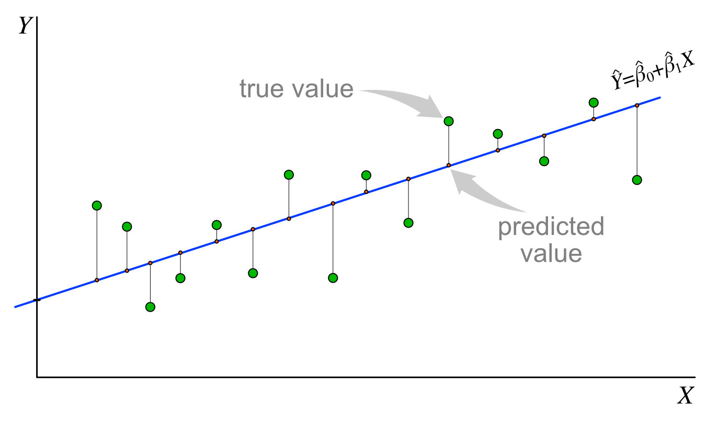
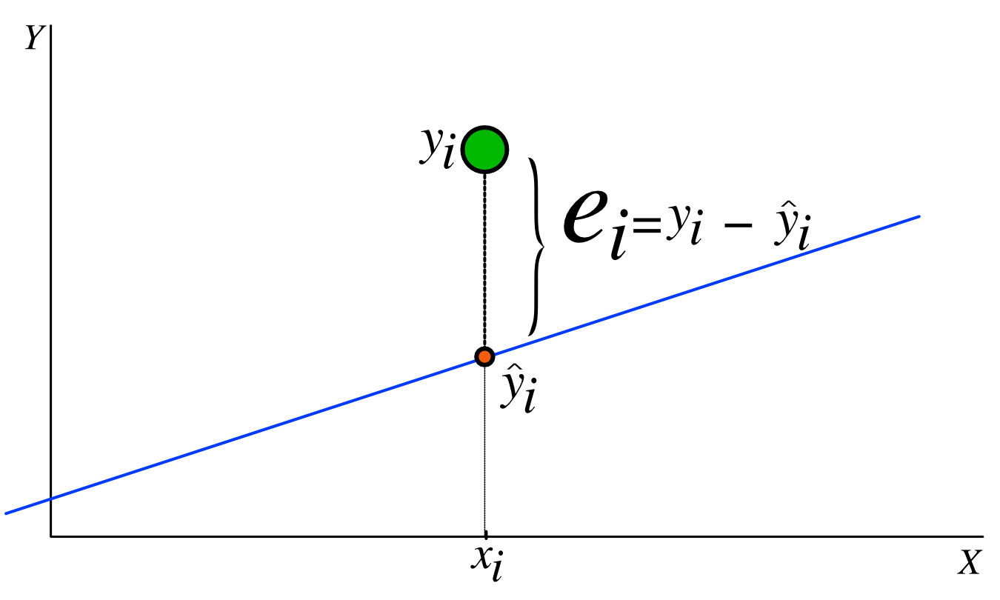
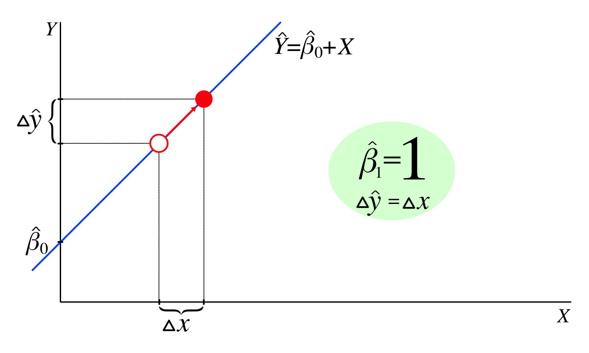
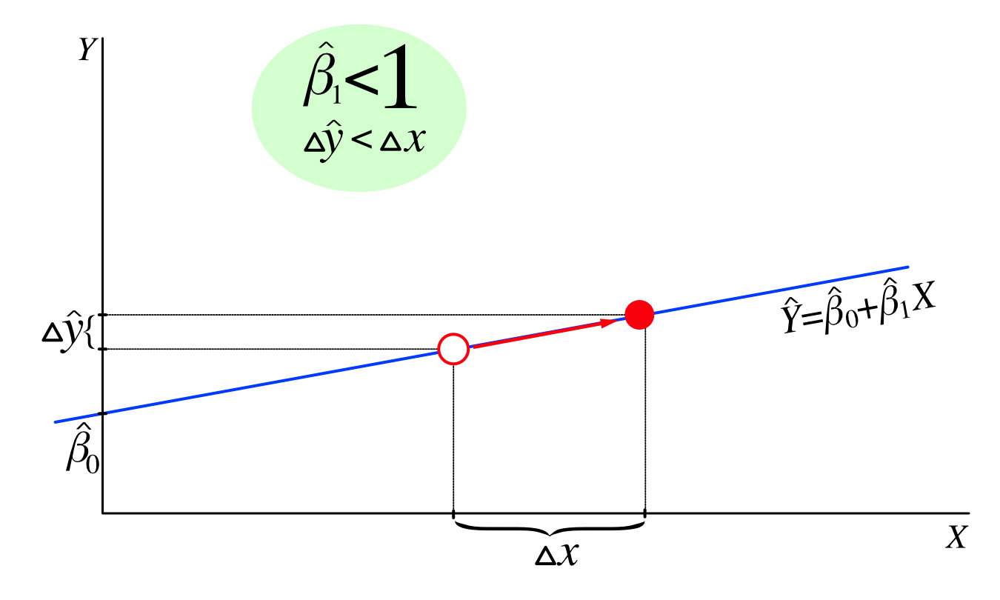
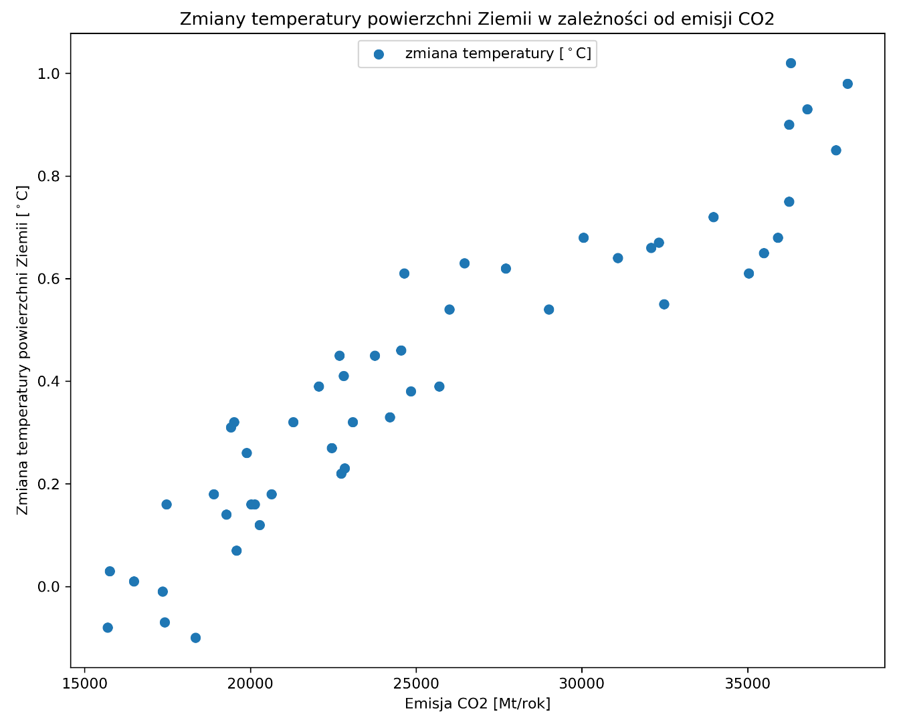
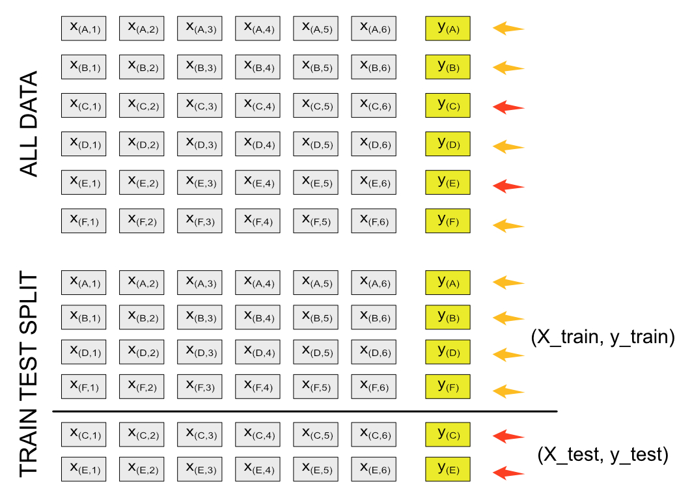

###### Every modern, living organism - often unaware of this fact - functions balancing on the sharp edge separating the world we know perfectly well from the world we certainly do not want. Human activity, that is, let us put it bluntly - each of us - has brought the border closer, the crossing of which means the irretrievable loss of our life-giving environment. Harmful emissions of the so-called greenhouse gases are just one example of this ruthless devastation. Unfortunately, we will not solve the pressing problems in this post, but they will serve as a means of introducing you to one of the methods used in machine learning - linear regression.

### Statistics to the rescue
Statistics tries to answer many difficult questions by using data for this purpose. Such issues include an attempt to find and describe the relationship between features, in other words, to answer the question: *how will the change of one property affect the value of another?*

One of the simplest and most basic methods of studying the relationship between a feature (*independent variable*) and response (in other words - *dependent variable* or *target*) is the linear regression method. Understanding the concept behind it may be the key to understanding how many various models work. It applies to both the area of machine learning and neural networks.  

#### A few words about the construction of the hammer 
The linear regression method assumes the existence of a *linear relationship* between the already mentioned variables, i.e. the feature and the target. In its simplest form, it allows you to predict a quantitative answer (let's denote it as Y) based on changes in the value of a feature (let's mark it as X):
$$
Y\approx \beta_{0} + \beta_{1}X \tag{1}
$$

A glance at three essential aspects of the model will help us understand it better:  

  

**Aspect 1: regression roefficients**  
The essence of the method is to train the model on the so-called training set that allows you to calculate the values of the regression coefficients $\beta_{0}$ and $\beta_{1}$.  
The linear regression coefficients $\beta_{0}$, $\beta_{1}$ are responsible for the course of the line defined by the formula (1), and specifically for its slope concerning the oX axis ($\beta_{1}$) and the place of intersection of the line with the oY axis ($\beta_ {0}$). It is worth noting that from the definition of the $\beta_{1} = \frac{\Delta y_{i}}{\Delta x_{i}}$ coefficient, it follows that it is the tangent of the angle formed by the regression line with the axis oX.

 

**Aspect 2: the course of the regression curve**  
We want to find the values of the $\beta_ {0}$ and $\beta_ {1}$ coefficients for which the straight line defined by the formula (1) runs as close as possible to the points representing the actual observations. The determined straight line is a set of values that are predictions of our model. 



**Aspect 3: prediction error**  
The distance between the value predicted by the model ($\hat{y}_{i}$) and the actual observation ($y_{i}$) is nothing more than the prediction error ($e_{i}$):<br class='before-equation'/>
$e_{i} = y_{i} - \hat{y}_{i}$  

The optimal solution for the model is to minimize the overall prediction error for all observations. For this, we use the **residual sum of squares** method.:  
$$
RSS = e_{1}^2 + e_{2}^2 + e_{3}^2 + \dotsb + e_{i}^2 = \sum_{i=1}^n (y_{i} - \hat{y}_{i})^2
$$  

Squaring each error lets us avoid a mutual "cancelling out" of the under- and overestimation errors. Suppose that in the set of observations, we have points with the values 5, 8, 7, and 10. Our model returned predictions for these points with the values 6, 7, 8, and 9, respectively. If we now tried to sum the prediction errors e_ {i} for these values, we would have received:

$$
e_{1}+e_{2}+e_{3}+e_{4} = (5-6)+(8-7)+(7-8)+(10-9) = -1+1-1+1 = 0
$$

We should conclude that the model perfectly works because it doesn't make a mistake (the error is 0). But this completely contradicts the actual situation. Using RSS relieves us of this problem:

$$
e_{1}^2+e_{2}^2+e_{3}^2+e_{4}^2 = (5-6)^2+(8-7)^2+(7-8)^2+(10-9)^2 = 1+1+1+1 = 4
$$

#### How to count it?
I mentioned earlier that the linear regression model uses training data to calculate the $\beta_ {0}$, $\beta_ {1}$ coefficients using the least squares method. In simplified terms, the essence of this method comes down to the calculation of the coefficients using the formulas:

$$
\beta_{1} = \frac{\sum_{i=1}^{n}(x_{i} - \bar{x})(y_{i} - \bar{y})}{\sum_{i=1}^{n}(x_{i} - \bar{x})^2}\tag{2}
$$

$$
\beta_{0} = \bar{y} - \beta_{1}\bar{x}\tag{3}
$$

In the above formulas, $\bar{x}$ and $\bar{y}$ denote the mean value for the feature and the target, respectively. Cool, but what's going on? While it is easy to explain equation (3) because you can see at a glance that it is a mathematical "consequence" resulting from the regression equation (1) itself (you need to transform it). If it comes to the equation for $\beta_ {1}$ (2) is not so clear on the level of intuitive understanding. But let's try to think about it for a moment. 


  

We know that $\beta_ {1}$ is responsible for the slope of the regression line towards the oX axis. Let's first assume that $x_{i} = y_{i}$. Then: <br class='before-equation' />
$\beta_{1} = \frac{\sum_{i=1}^{n}(x_{i} - \bar{x})(x_{i} - \bar{x})}{\sum_{i=1}^{n}(x_{i} - \bar{x})^2} = \frac{\sum_{i=1}^{n}(x_{i} - \bar{x})^2}{\sum_{i=1}^{n}(x_{i} - \bar{x})^2} = 1$
It means that each change in the value of the feature (X) corresponds to the precisely equal change in the target value (Y). It manifests in a straight line inclined 45 degrees to the x-axis ($tg45^\circ =1$) on the graph.



Now, look at another case. Changing the value of the feature causes a much smaller reaction of the target, i.e. $\Delta x > \Delta y$. Then for each pair $x_{i}, y_{i}$, the inequality will be true:<br class='before-equation' /> 
$(x_{i} - \bar{x})(y_{i} - \bar{y}) <(x_{i} - \bar{x})^2$ (the square of any number will always be greater than the product of this number and the lower number below).  
What does this mean for the $\beta_{1}$ ratio? If we divide a small number by the greater, we always get a result less than 1: <br class='before-equation' />
$\beta_{1} = \frac{\sum_{i=1}^{n}(x_{i} - \bar{x})(y_{i} - \bar{y})}{\sum_{i=1}^{n}(x_{i} - \bar{x})^2} < 1$  
The straight line formed by the regression equation based on such a factor beta_ {1} will be inclined concerning the oX axis by an angle of fewer than 45 degrees. It is intuitive since we know the tangent in the range $0^\circ$ do $45^\circ$ is less than 1.  

I hope it makes more sense to you now.

#### We take a hammer in our hand, so how does it work in practice?
Fortunately, you don't have to do the above calculations (unless you are one of those who like it). The **scikit-learn** library provides you with the necessary set of tools that allows you to build a linear regression model for your data.

We will try to investigate the impact of carbon dioxide emissions on the effect of global warming and predict the scale of this phenomenon for a short time. To train the model, we will use data published in the EDGAR database (Emissions Database for Global Atmospheric Research), prepared by the European Commission. The report includes, among others, estimates of greenhouse gas emissions, processed for each country (on a global scale), dating back to 1970. The entire file in MS Excel format is ready for download from the official website of the European Commission <a href='https://edgar.jrc.ec.europa.eu/report_2021#data_download' class='visible' target='_blank' rel='noreferer'>EDGAR</a>  

```python lineNumbers
import pandas as pd
import numpy as np

from sklearn.linear_model import LinearRegression
from sklearn.metrics import mean_squared_error
from sklearn.model_selection import train_test_split

import matplotlib.pyplot as plt
%matplotlib inline
```  
Traditionally, we start with importing the necessary libraries. We will need the Pandas and Numpy libraries to perform data transformations. Additionally, we will engage the matplotlib library to prepare the visualization. Building the model and predicting the values ​​we are looking for will be possible thanks to the aforementioned scikit-learn library, from which we will import the **LinearRegression** linear regression model, the **mean_squared_error** metric to evaluate the effectiveness of the model and the **train_test_split** function as a support in the training process.  

Now we will load the data from the downloaded Excel file. In our analysis, we want to focus on determining the global degree of CO<sub>2</sub> emissions, so we use the information stored in the sheet *"fossil_CO2_totals_by_country"*. It contains data showing CO<sub>2</sub> emissions, expressed in megatons (Mt) over one year. Each of the columns consists of values ​​for one year in each country. Consequently, each row contains a time series for one country (not counting items for air and sea transport). The most important for us is the entry in the last line, *"GLOBAL TOTAL"*, summarizing the values ​​for the whole world::  

|country_name	|1970	    |1971	    |1972	    |1973	    |…    |2019    |
|:---         |:---:    |:---:    |:---:    |:---:    |:---:|--- :   |
|Afghanistan	|1,48	    |1,48	    |1,53	    |1,49   	|…	  |11,00   |
|Albania	    |4,72	    |4,72	    |5,37	    |4,79	    |…    |5,66    |
|Algeria	    |18,93    |22,31    |34,37    |46,47    |…    |180,57  |
|...          |...      |...      |...      |...      |...  |...     |
|GLOBAL TOTAL |15 760,00|15 690,85|16 484,39|17 464,80|	…	  |38 016,5|

<span class='post-paragraph text-sm mb-8'>Source: Crippa, M., Guizzardi, D., Muntean, M., Schaaf, E., Solazzo, E., Monforti-Ferrario, F., Olivier, J.G.J., Vignati, E., Fossil CO2 emissions of all world countries - 2020 Report, EUR 30358 EN, Publications Office of the European Union, Luxembourg, 2020, ISBN 978-92-76-21515-8, doi:10.2760/143674, JRC121460.</span>  

  

We read data from the file using the Pandas library and the read_excel method, giving respectively as parameters:

`pd.read_excel(excel_file_name, sheet_name, index_col=named_column_with_index)`

```python lineNumbers
emission = pd.read_excel('EDGARv5.0_FT2019_fossil_CO2_booklet2020.xls', 'fossil_CO2_totals_by_country', index_col = 'country_name')
index = pd.Index(emission.columns, name='year')
emission = emission.T.reindex(index)['GLOBAL TOTAL'].to_frame()
emission.loc[2010:2023]
```
Thanks to this operation, we can create a data frame (**DataFrame**) and save it to a variable, e.g. emission. Since we want to analyze the variability of the global CO<sub>2</sub> emission value over time, we have to transpose our DataFrame using the <span className='inline-code'>transpose</span> method (T for short), i.e. in short, replace the rows with the columns. As a result, we will obtain a single data series for world emissions indexed over the years. Using the <span className='inline-code'>.to_frame()</span> method converts the data series into a DataFrame. Before we do that, we should create an appropriate index based on the source frame using the <span class='inline-code'>Index</span> method of the Pandas library:
`pd.Index(data=array_with_years, name=name_of_new_index)`

Let's do a quick data visualization:
```python lineNumbers
plt.plot(emission.index, emission['GLOBAL TOTAL'], label="$emission \:CO_2$", lw=3)
plt.title('Carbon dioxide emission in the world')
plt.xlabel('Year')
plt.ylabel('CO2 emission (Mt/year)')
plt.legend(loc='right')
plt.show();
```
Using the **matplotlib** library, we draw a line graph. We pass the previously prepared data to the <span class='inline-code'>plot()</span> method. Information about years is included in the *emission* data frame index, while the CO<sub>2</sub> emission values are in the *GLOBAL TOTAL* column.

I warn more sensitive people that the results may shock ;):

  

A curve represents the changing global level of carbon dioxide emissions to the atmosphere. It clearly shows how ruthless human activity is for the environment. The last four decades have seen an almost twofold increase in the emission of harmful gases into the atmosphere. If this does not convince someone, I do not know what could...  

Remember that our goal is to study the impact of atmospheric gas emissions on global warming. The only thing we are missing at this stage is... data on temperature changes!

Fortunately, there are many sources from which we can download them. I have selected for you the information available on the NASA website, which for many years has been analyzing the changes in the surface temperature of our planet based on the available data sets. You can download the file <a href='https://data.giss.nasa.gov/gistemp/tabledata_v4/GLB.Ts+dSST.csv' className='visible'>here</a>. The collected information includes time series of changes in the average temperature of the Earth's surface:

|Year	|Jan	|Feb	|Mar	|…	  |Oct	|Nov	|Dec	|J-D	|D-N	|DJF	|MAM	|JJA	|SON  |
|:---	|:---:|:---:|:---:|:---:|:---:|:---:|:---:|:---:|:---:|:---:|:---:|:---:|---: |
|1880 |-0,17|-0,23|-0,08|…    |-0,22|-0,20|-0,16|-0,16|***  |***  |-0,10|-0,15|-0,18|
|1881 |-0,18|-0,13|0,04 |…    |-0,20|-0,17|-0,05|-0,07|-0,08|-0,16|0,06 |-0,06|-0,17|
|1882 |0,18 |0,15 |0,05 |…    |-0,23|-0,15|-0,35|-0,10|-0,07|0,09 |-0,08|-0,14|-0,17|
|…    |…    |…    |…    |…    |…    |…    |…    |…    |…    |…    |…    |…    |…    |
|| ||1,03| |1,15 |1,17| |…    |0,90 |0,88 |0,94 |0,93 |0,92 |1,01 |1,01 |0,80 |0,85 |
||2018 |0,82 |0,85 |0,90 |…    |1,02 |0,83 |0,92 |0,85 |0,86 |0,87 |0,87 |0,79 |0,89 |
||2019 |0,94 |0,96 |1,18 |…    |1,02 |1,00 |1,10 |0,98 |0,97 |0,94 |1,02 |0,94 |0,98 |
||…    |…    |…    |…    |…    |…    |…    |…    |…    |…    |…    |…    |…    |…    |||

  
<span class='post-paragraph text-sm mb-8'>Source: GISTEMP Team, 2021: GISS Surface Temperature Analysis (GISTEMP), version 4. NASA Goddard Institute for Space Studies. Dataset accessed 2021-03-30 at data.giss.nasa.gov/gistemp/.
Lenssen, N., G. Schmidt, J. Hansen, M. Menne, A. Persin, R. Ruedy, and D. Zyss, 2019: Improvements in the GISTEMP uncertainty model. J. Geophys. Res. Atmos., 124, no. 12, 6307-6326, doi:10.1029/2018JD029522.</span>

We want to investigate the annual average level of temperature changes. For exploration, we will need the data in the column named *J-D*, which stores the average value of changes in this physical quantity calculated based on 12 months (January-December). In our analysis so far, we have dealt with the phenomena described in the years 1970-2019, therefore when importing data into a frame, we will take into account the following scope:

```python lineNumbers
gistemp = pd.read_csv('https://data.giss.nasa.gov/gistemp/tabledata_v4/GLB.Ts+dSST.csv', delimiter = ',', skiprows = 1, sep = '.')
gistemp = gistemp[['Year', 'J-D']].set_index(['Year']).loc[1970:2019]
gistemp['J-D'] = gistemp['J-D'].astype(float)
gistemp.head(6)
# After running the code, the first six lines of the frame will be visible:
```

|Year	|J-D|
|---|---:|
|1970	|0.03|
|1971|-0.08|
|1972	|0.01|
|1973	|0.16|
|1974	|-0.07|
|1975	|-0.01|

Let's combine the newly loaded data with the previously available information on CO<sub>2</sub> emissions...
```python lineNumbers
global_warming = pd.concat([gistemp, emission], axis=1)
global_warming.sample(6)
# After running the code, you will see six randomly selected lines of the frame:
```
|	|J-D	|GLOBAL TOTAL|
|---|---:|---:|
|2017	|0.93	|36794.620795|
|1985	|0.12	|20279.954115|
|1998	|0.61	|24638.044086|
|2009	|0.66	|32090.505920|
|2008	|0.55	|32475.438985|
|1970	|0.03	|15760.000532|

...and let's do a quick visualization:
```python lineNumbers
plt.scatter(global_warming['GLOBAL TOTAL'], global_warming['J-D'], label='temperature change [$^\circ$C]')
plt.title('Earth surface temperature changes depending on CO2 emissions')
plt.xlabel('CO2 emission [Mt/year]')
plt.ylabel('Change in the temperature of the Earths surface [$^\circ$C]')
plt.legend(loc='upper center')
plt.show();
```
<p></p>



The chart shows a clearly-cutting upward trend. 

#### Simple linear regression model.

We base our analysis on only one feature - carbon dioxide emissions.
```python lineNumbers
X = global_warming['GLOBAL TOTAL'].values.reshape(-1, 1)
y = global_warming['J-D'].values.reshape(-1, 1)

X_train, X_test, y_train, y_test = train_test_split(X, y, test_size=0.1, random_state=33)
X_train.shape, X_test.shape, y_train.shape, y_test.shape

# Below is the effect of the command in line 5
# >>> ((45, 1), (5, 1), (45, 1), (5, 1))
```
We pass the feature to the variable *X*. We put the target (the level of temperature change) in the *y* variable. We will use the auxiliary function <span className='inline-code'>train_test_split()</span> to randomly split the set of values into training and test parts. `train_test_split(features_set, target, test_size = test_set_size)`. It should improve the training efficiency of the model.

You may notice that the result of the <span className='inline-code'>train_test_split()</span> function consists of four data sets: two training sets (*X_train, y_train*) and two test sets (*X_test, y_test*) for model validation. The training sets have 45 elements, and the test sets have 5. It is due to the test_size parameter passed in the function having the value 0.1. It means that 10% of the elements of the entire set will be in the test part (precisely 5 out of 50 in this case).

  

The principle of the <span className='inline-code'>train_test_split()</span> method is simple. It randomly selects the elements of our dataset, dividing it into a training and a test part. For each set of features (*X*) in the training set, this method assigns an appropriate target value (*y*). It does the same for the test set. With this approach, everyone can easily subject the model to a validation (quality assessment) process using the training data. It is worth noting that this is one of the more basic optimization methods.

Now it's time to train the model. We use the already mentioned  <span className='inline-code'>LinearRegression()</span> model.

```python lineNumbers
model = LinearRegression()
model.fit(X_train, y_train)
```

The <span className='inline-code'>.fit()</span> method is responsible for proper training the model (that is, calculating the coefficients of the regression equation in this case) based on the training set.  

To assess the quality of the model's training, we need to see what mistakes it makes. We need the test set we obtained earlier (*X_test*) for that.

```python lineNumbers
y_pred = model.predict(X_test)
```  

We pass the test set of features (*X_test*) to the model's <span className='inline-code'>.predict()</span> method and store the prediction results in the *y_pred* variable.  

Now we're all set to count the *mean squared error*. Of course, there is a function for this in scikit-learn:
`mean_squared_error(values_predicted_by_model, test_set_target_values)`

```python lineNumbers
mse = mean_squared_error(y_pred, y_test)
print(f'RMSE:{np.sqrt(mse): .3f}, R2:{model.score(X_test, y_test): .3f}')

# The outcome of the above code execution
# >>> RMSE: 0.077, R2: 0.932
```  
Since the calculated error is the mean square of the difference between the prediction and the actual value, we will extract the root (<span className='inline-code'>np.sqrt(mse)</span>). Such a procedure will allow us to bring the value of the error to the "nominal" level (that is, the level at which we express the values of the target). De facto, the error calculated in this way is called **root mean squared error** (*RMSE* - for short). Yes, I know what you're thinking - that sounds like a tautology 😉.

In addition, we will use the *LinearRegression()* model <span className='inline-code'>.score()</span> method [2], which will calculate another metric of model fit for us, specifically the **coefficient of determination**, or otherwise **R-square** (*R<sup>2</sup>*). In the case of a perfect fit to the data, its value is close to or equal to 1 (unity).  
The value of the RMSE error is not so small, but in this article, we will not try to minimize it more. A keen eye will notice one of the causes of this problem. A quick look at the graph we prepared earlier ( ) and we can see that the course of variation in the occurrence of temperature anomalies depending on CO2 emissions is not perfectly linear. And we use the model...? Exactly 😉 Moreover, the value of the R2 metric at 0.93 opens the door to the next stage of the experiment.  

#### Let us predict the future.
So far, we have been able to use the model to find out the extent two phenomena depend on each other. Here is a little digression. Note that you can use the model to quantify the dependence between a trait and a target. However, it does not specify what the nature of this dependence is. In other words, it does not answer the question of the interaction of phenomena. It won't give us an answer to the question of what is the source and what is the cause of variation. Now let's try to use our newly acquired knowledge to estimate the level of global warming in the next few years.  

To begin with, we will make some assumptions. Let's assume for simplicity that the value of CO2 emissions into the atmosphere will increase each year by a fixed percentage, calculated based on the last five years. We will use an indicator familiar from financial analysis known as the compound annual growth rate (CAGR). We count it as follows:
$$
CAGR = \left(\frac{EV}{BV}\right)^{\frac{1}{n}} - 1
$$

$EV$ is the value of the trait in the last year of the period under study, $BV$ is the value in the first year, and $n$ is the number of years covering the period under study. Let's now implement the CAGR indicator in Python:

```python lineNumbers
def cagr(ending_year, beggining_year, df):
    '''
    ending_year (int) - final year
    beggining_year (int) - starting year
    df (DataFrame) - a frame containing data indexed by years
    '''
    assert beggining_year in df.index, f'incorrect starting year: {beggining_year}'
    assert ending_year in df.index, f'incorrect final year: {ending_year}'
    assert ending_year != beggining_year, f'The start and end dates are the same!'
    
    beggining_value = df.loc[beggining_year]
    ending_value = df.loc[ending_year]
    return float(pow( ending_value/beggining_value, 1 / (ending_year - beggining_year) ) - 1 
```
<p></p> 

Let's now calculate the projected values of CO<sub>2</sub> emissions for 2020-2025. We will use the 2019 values of this factor as the basis for the calculation [1]. We will calculate the average annual growth rate based on data from the last six years (2014 - 2019) using the <span className='inline-code'>cagr()</span> function defined earlier[2]:  

```python lineNumbers
base = emission.loc[2019].values[0]
growth = cagr(2014, 2019, emission)
print('CO2 emissions in the base year: %1.2f, average annual growth: %1.4f%%' % (base, growth * 100))

# >>> CO2 emissions in the base year: 38016.57, average annual growth: 0.9593%
```  

A simple loop [3] will allow us to use the values we just calculated to estimate future CO<sub>2</sub> emissions. Save the whole thing in the newly created frame [1]:   

```python lineNumbers
future_emission = pd.DataFrame()

for year in range(2020, 2026):
    base = base + base * growth
    future_emission = future_emission.append({'year': year, 'GLOBAL TOTAL': base}, ignore_index = True)
    
future_emission['year'] = future_emission['year'].astype(int)
future_emission.set_index('year', inplace=True)
future_emission

# After running the above code, you will see data in the frame 'future_emission':
```  

|year	|GLOBAL TOTAL	|
|---  |---:         |
|2020	|38381.253944	|
|2021	|38749.433612	|
|2022	|39121.145116	|
|2023	|39496.422335	|
|2024	|39875.299473	|

There is only one thing left... Yes, we will use a trained linear regression model to predict the level of global warming 🙂 Since you are already at this point in the article, nothing below is magic to you. So...:
```python lineNumbers
X_future = future_emission['GLOBAL TOTAL'].values.reshape(-1, 1)
future_emission['J-D'] = model.predict(X_future)
future_emission

# after running the above code, you will see the contents of the 'future_emission' frame along with the forecast in column 'J-D':
```
|year	|GLOBAL TOTAL	|J-D     |
|---  |---:         |---:    |
|2020	|38381.253944	|0.926396|
|2021	|38749.433612	|0.940895|
|2022	|39121.145116	|0.955534|
|2023	|39496.422335	|0.970312|
|2024	|39875.299473	|0.985232|
|2025	|40257.811065	|1.000296|

<p></p>

Certainly, visualization will help us put the results into better perspective:  

```python lineNumbers
emission_range = (np.linspace(global_warming['GLOBAL TOTAL'].min(), global_warming['GLOBAL TOTAL'].max()))

ax1 = plt.subplot(211)
ax1.plot(emission_range, (beta_1 * emission_range + beta_0), c='r', ls=':', label=f'Regression model curve: Y={beta_1}X + {beta_0}')
ax1.scatter(global_warming['GLOBAL TOTAL'], global_warming['J-D'], label=f'Recorded temperature changes')
ax1.scatter(future_emission['GLOBAL TOTAL'], future_emission['J-D'], c='w', edgecolor='r', label="Prediction of temperature changes")
ax1.set_ylabel('Change in the temperature of the Earths surface [$^\circ$C]')
ax1.set_xlabel('CO2 emission [Mt/year]')
ax1.title.set_text('Earth surface temperature changes depending on CO2 emissions')
ax1.legend()

ax2 = plt.subplot(212)
ax2.plot(global_warming.index, global_warming['J-D'], label=f'Recorded temperature changes')
ax2.scatter(future_emission.index, future_emission['J-D'], c='w', edgecolor='r', label="Prediction of temperature changes")
ax2.set_ylabel('Change in the temperature of the Earths surface [$^\circ$C]')
ax2.set_xlabel('Year')
ax2.set_xticks(range(1970, 2026, 5))
ax2.title.set_text('Changes in the Earths surface temperature in successive years')
ax2.legend()
plt.tight_layout()
plt.show();
```

<p></p>


You can see that the model allows us to predict the values of temperature changes in the future based on our estimates of the level of greenhouse gas emissions into the atmosphere. Since we used linear regression, the answer we obtained in our experiment obviously lies along a straight line. The course over time of the points along the straight line, i.e. the increasing trend, suggests the conclusion that a lack of regulation of harmful gas emissions could unceremoniously lead to an environmental catastrophe 🙁

#### Only calmness will save us... (and more common sense)
For reassurance at the end, here is a small summary. The linear regression model we used is one of the simplest models and thus has many drawbacks and limitations. Among the main ones is precisely its simplicity, which often makes it difficult to fit the data. It is because the phenomena occurring in our world are usually not linear. We created our forecast using only one parameter, thus ignoring the influence of other factors on the process of climate warming. That results in a kind of cumulative prediction error. Therefore, the results we obtained do not fully reflect the nature of the process that is global warming.
