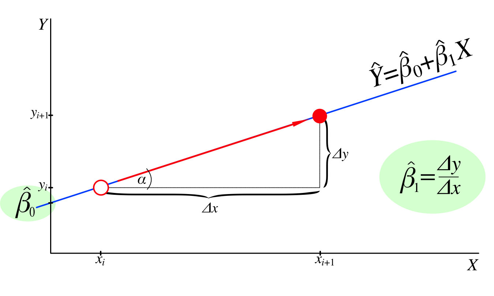
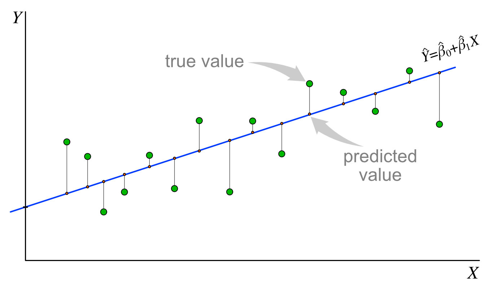
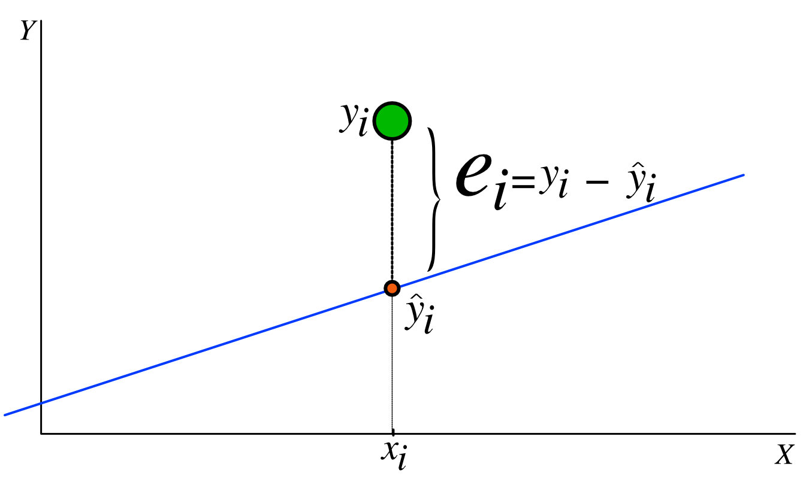
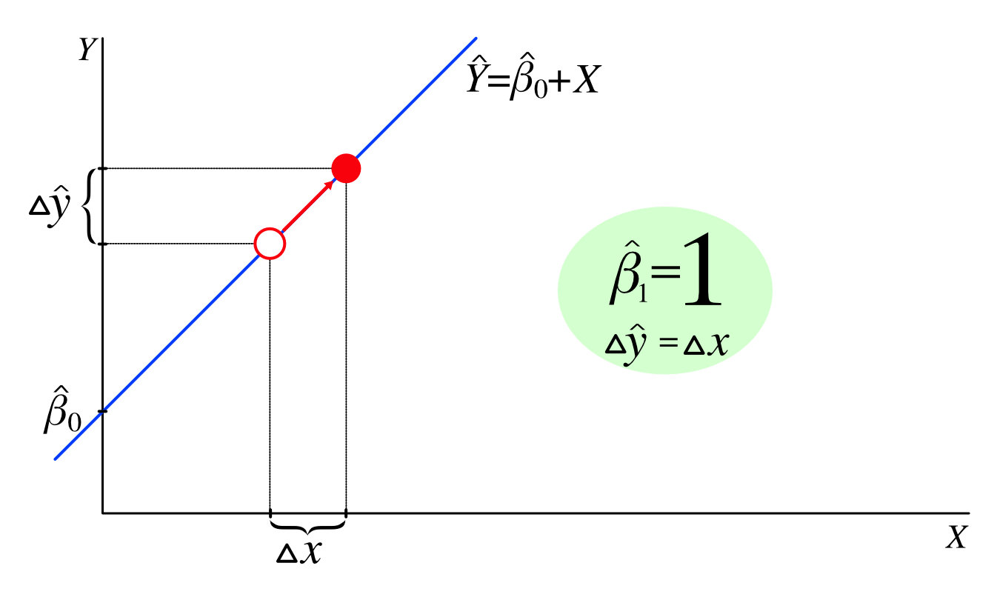
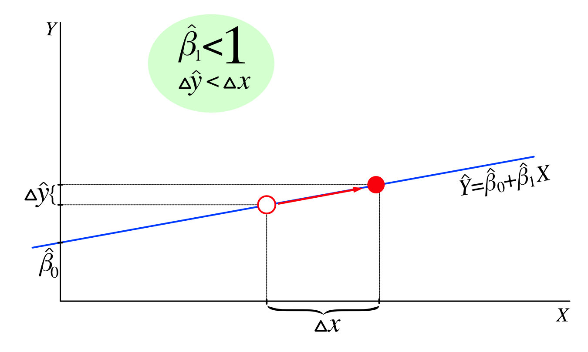
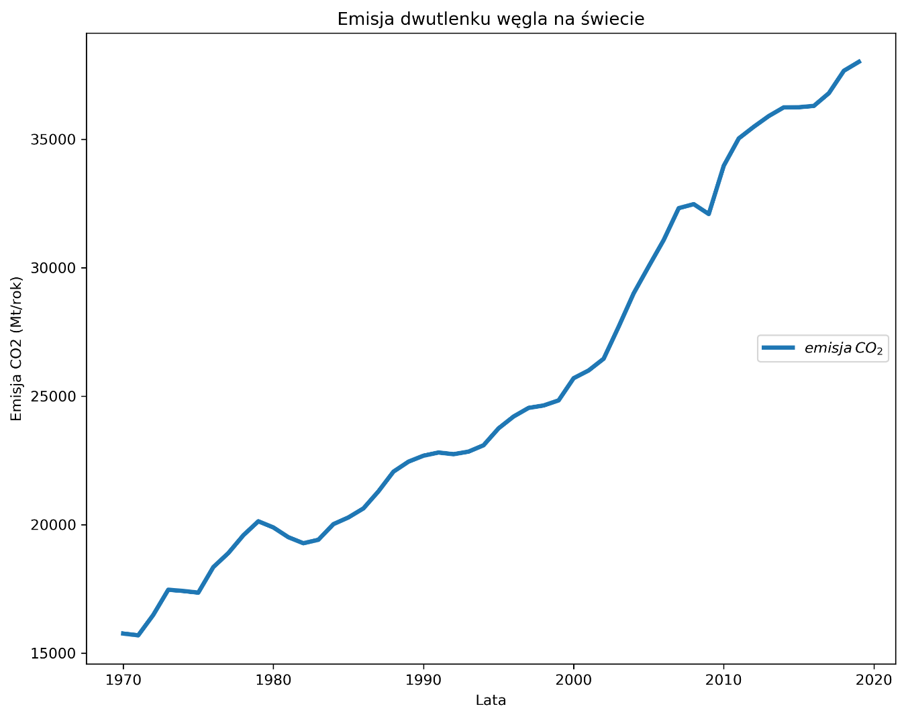
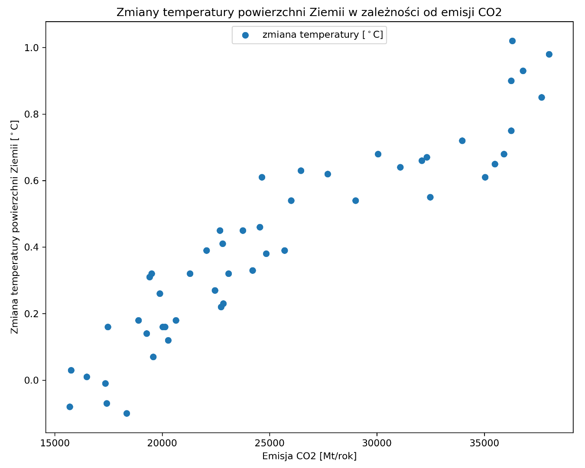
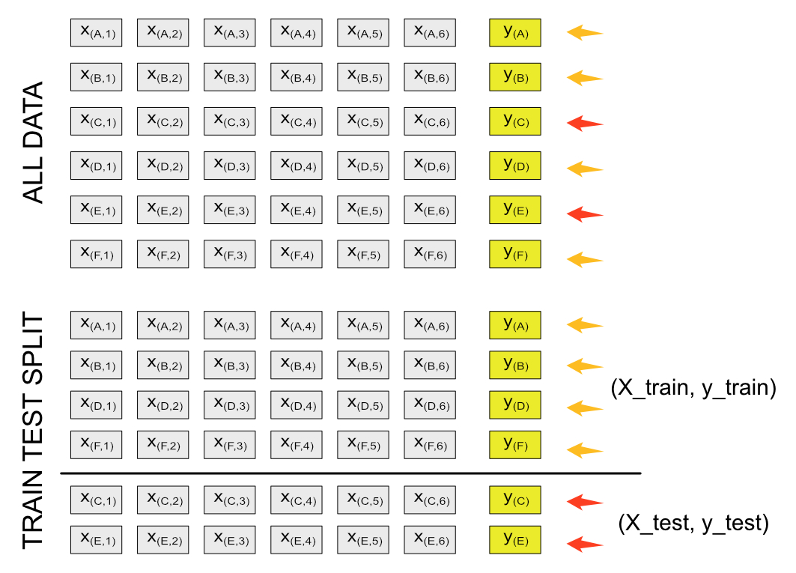
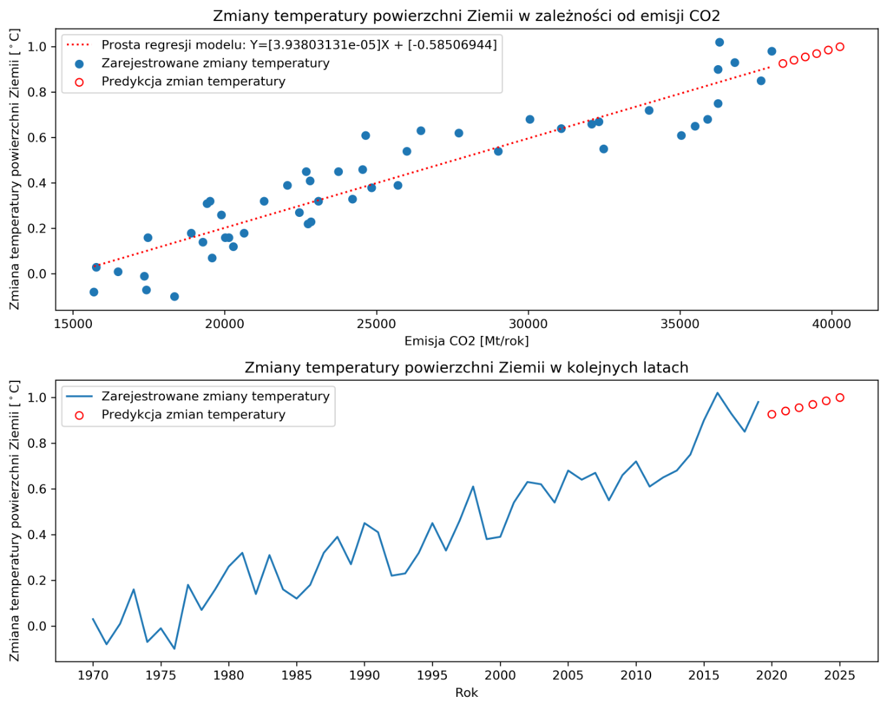

###### Każdy współczesny, żywy organizm - często nieświadomy tego faktu - funkcjonuje balansując na ostrej krawędzi rozdzielającej świat jaki doskonale znamy od tego, którego napewno nie chcemy. Działalność człowieka, czyli powiedzmy wprost - każdego z nas - przybliżyła granicę, której przekroczenie oznacza bezpowrotną utratę naszego życiodajnego środowiska. Szkodliwa emisja tzw. gazów cieplarnianych, to tylko jeden z wielu przykładów tej bezlitosnej dewastacji. Niestety w tym poście nie rozwiążemy palących problemów, ale posłużą one jako środek do zapoznania się z jedną z metod używanych w uczeniu maszynowym - regresji liniowej.

### Statystyka na pomoc

Statystyka stara się znaleźć odpowiedź na wiele trudnych pytań, wykorzystując do tego celu dane. Do takich zagadnień możemy zaliczyć próbę znalezienia i opisania zależności pomiędzy cechami, czyli inaczej mówiąc odpowiedzi na pytanie: *jak zmiana wartości jednej cechy wpłynie na wartość innej cechy?*.  

Jedną z najprostszych i najbardziej podstawowych metod badania zależności pomiędzy cechą (*zmienną niezależną*) a odpowiedzią (inaczej mówiąc *zmienną zależną* lub *targetem*) jest metoda **regresji liniowej**. Poznanie stojącej za nią koncepcji, może okazać się kluczowe do zrozumienia działania innych modeli. Dotyczy to zarówno obszaru uczenia maszynowego jak i sieci neuronowych.  

#### O budowie młotka słów kilka  
Metoda regresji liniowej zakłada, że pomiędzy wyżej wspomnianymi zmiennymi a więc cechą i targetem występuje *liniowa zależność*. W swojej najprostszej odsłonie, pozwala ona na predykcję ilościowej odpowiedzi (oznaczmy ją jako Y) na podstawie zmian wartości jakiejś cechy (oznaczmy ją jako X):  
$$
Y\approx \beta_{0} + \beta_{1}X \tag{1}
$$

Rzut okiem na trzy kluczowe aspekty modelu, pozwolą nam go lepiej zrozumieć:  

  

**Aspekt 1: współczynniki regresji**  
Istotą działania metody jest trenowanie modelu na tzw. zbiorze treningowym, które umożliwia obliczenie wartości współczynników regresji $\beta_{0}$ i $\beta_{1}$.  
Współczynniki regresji liniowej $\beta_{0}$, $\beta_{1}$ odpowiadają za przebieg prostej określonej wzorem (1), a konkretnie za jej nachylenie względem osi oX ($\beta_{1}$) oraz miejsce przecięcia prostej z osią oY ($\beta_{0}$). Warto zauważyć, że z definicji współczynnika $\beta_{1} = \frac{\Delta y_{i}}{\Delta x_{i}}$ wynika, że jest to tangens kąta jaki tworzy prosta z osią oX.

 

**Aspekt 2: przebieg krzywej regresji**  
Zależy nam na tym, aby znaleźć takie wartości współczynników $\beta_{0}$ i $\beta_{1}$, dla których linia prosta, określona przez wzór (1) przebiega w jak najmniejszej odległości od punktów reprezentujących rzeczywiste obserwacje. Wyznaczona linia prosta stanowi zbiór punktów, będących predykcjami naszego modelu.  



**Aspekt 3: błąd predykcji**  
Odległość między wartością przewidzianą przez model ($\hat{y}_{i}$) a rzeczywistą obserwacją ($y_{i}$) to nic innego jak błąd predykcji ($e_{i}$):<br class='before-equation'/>
$e_{i} = y_{i} - \hat{y}_{i}$  

Optymalnym rozwiązaniem dla modelu jest zminimalizowanie ogólnego błędu predykcji dla wszystkich obserwacji. Wykorzystujemy do tego **metodę najmniejszych kwadratów** (*residual sum of squares*):  
$$
RSS = e_{1}^2 + e_{2}^2 + e_{3}^2 + \dotsb + e_{i}^2 = \sum_{i=1}^n (y_{i} - \hat{y}_{i})^2
$$  

Podniesienie każdego błędu do kwadratu ma na celu uniknięcie sytuacji wzajemnego "znoszenia się" błędów niedoszacowania i przeszacowania predykcji. Załóżmy, że w zbiorze rzeczywistych obserwacji mamy punkty o wartościach 5, 8, 7, 10. Nasz model zwrócił predykcje dla tych punktów o wartościach odpowiednio 6, 7, 8, 9. Gdybyśmy teraz spróbowali zsumować błędy predykcji $e_{i}$ dla tych obserwacji otrzymalibyśmy:

$$
e_{1}+e_{2}+e_{3}+e_{4} = (5-6)+(8-7)+(7-8)+(10-9) = -1+1-1+1 = 0
$$

Powinniśmy wysnuć wniosek, że model działa idealnie, gdyż nie popełnia błędu (błąd wynosi 0). Przeczy to w zupełności rzeczywistej sytuacji. Użycie RSS, uwalnia nas od tego problemu:

$$
e_{1}^2+e_{2}^2+e_{3}^2+e_{4}^2 = (5-6)^2+(8-7)^2+(7-8)^2+(10-9)^2 = 1+1+1+1 = 4
$$

#### Jak to policzyć?
Wspomniałem wcześniej, że model regresji liniowej wykorzystuje dane treningowe do kalkulacji współczynników $\beta_{0}$, $\beta_{1}$ za pomocą metody najmniejszych kwadratów. W uproszczeniu istota tej metody sprowadza się do kalkulacji współczynników za pomocą wzorów:

$$
\beta_{1} = \frac{\sum_{i=1}^{n}(x_{i} - \bar{x})(y_{i} - \bar{y})}{\sum_{i=1}^{n}(x_{i} - \bar{x})^2}\tag{2}
$$

$$
\beta_{0} = \bar{y} - \beta_{1}\bar{x}\tag{3}
$$

W powyższych wzorach $\bar{x}$ oraz $\bar{y}$ oznaczają odpowiednio wartość średnią dla cechy oraz wartość średnią dla targetu. Fajnie, tylko... o co w tym chodzi? O ile bardzo łatwo jest sobie wytłumaczyć równanie (3), gdyż na pierwszy rzut oka widać, że jest to matematyczna "konsekwencja" wynikająca z samego równania regresji (1) (wystarczy je po prostu przekształcić), o tyle równanie na $\beta_{1}$ (2) nie jest tak oczywiste na poziomie intuicyjnego zrozumienia. Spróbujmy się jednak nad tym chwilkę zastanowić.  


  

Wiemy, że $\beta_{1}$ odpowiada za nachylenie prostej regresji względem osi oX. Załóżmy najpierw, że $x_{i} =y_{i}$. Wtedy: <br class='before-equation' />
$\beta_{1} = \frac{\sum_{i=1}^{n}(x_{i} - \bar{x})(x_{i} - \bar{x})}{\sum_{i=1}^{n}(x_{i} - \bar{x})^2} = \frac{\sum_{i=1}^{n}(x_{i} - \bar{x})^2}{\sum_{i=1}^{n}(x_{i} - \bar{x})^2} = 1$
Oznacza to, że każdej zmianie wartości cechy (X) oznacza dokładnie taka sama co do wartości zmiana targetu (Y). Na wykresie, będzie się to manifestowało prostą nachyloną o 45 stopni do osi oX ($tg45^\circ =1$).  



Teraz popatrz na inny przypadek. Zmiana wartości cechy powoduje znacznie mniejszą reakcję targetu, czyli $\Delta x > \Delta y$. Wtedy dla każdej pary $x_{i}, y_{i}$ prawdziwa będzie nierówność:<br class='before-equation' /> $(x_{i} - \bar{x})(y_{i} - \bar{y}) <(x_{i} - \bar{x})^2$ (kwadrat dowolnej liczby będzie zawsze większy od iloczynu tej liczby i liczby od dniej mniejszej).  
Co to oznacza dla współczynnika $\beta_{1}$ ? Jeżeli będziemy dzielić liczbę mniejszą przez większą, to zawsze otrzymamy wynik mniejszy niż 1: <br class='before-equation' />$\beta_{1} = \frac{\sum_{i=1}^{n}(x_{i} - \bar{x})(y_{i} - \bar{y})}{\sum_{i=1}^{n}(x_{i} - \bar{x})^2} < 1$  
Linia prosta utworzona przez równanie regresji oparte na na takim współczynniku $\beta_{1}$ będzie nachylona względem osi oX pod kątem mniejszym niż 45 stopni. Jest to zgodne z naszą intuicją, gdyż wiemy, że tangens kąta w przedziale od $0^\circ$ do $45^\circ$ przyjmuje wartości mniejsze od 1.  

Mam nadzieję, że ma to teraz dla Ciebie większy sens.

#### Bierzemy młotek do ręki czyli, jak to działa w praktyce?
Na szczęście nie musisz wykonywać powyższych obliczeń samodzielnie (o ile nie należysz do osób, które to bardzo lubią). Biblioteka scikit-learn dostarcza Ci niezbędnego zestawu narzędzi, który w bardzo łatwy sposób pozwala zbudować model regresji liniowej dla Twoich danych.  

Postaramy się zbadać, jaki wpływ na efekt globalnego ocieplania ma emisja dwutlenku węgla oraz przewidzieć, jaka będzie skala tego zjawiska w niedalekiej przyszłości. Do wytrenowania modelu użyjemy danych opublikowanych w bazie EDGAR (Emissions Database for Global Atmospheric Research), przygotowywanych przez Komisję Europejską. Raport zawiera m.in. estymacje emisji gazów cieplarnianych, opracowanych dla każdego kraju (w skali światowej), sięgające swoją historią aż do roku 1970 i jest co roku aktualizowany. Gotowy plik w formacie MS Excel można pobrać ze oficjalnej strony Komisji Europejskiej <a href='https://edgar.jrc.ec.europa.eu/report_2021#data_download' class='visible' target='_blank' rel='noreferer'>EDGAR</a>  

```python lineNumbers
import pandas as pd
import numpy as np

from sklearn.linear_model import LinearRegression
from sklearn.metrics import mean_squared_error
from sklearn.model_selection import train_test_split

import matplotlib.pyplot as plt
%matplotlib inline
```  
Tradycyjnie rozpoczynamy od importu niezbędnych bibliotek. Potrzebne nam będą biblioteki Pandas oraz Numpy do wykonania przekształceń danych. Dodatkowo zaangażujemy bibliotekę matplotlib do przygotowania wizualizacji. Zbudowanie modelu i predykcję poszukiwanych przez nas wartości umożliwi wspominana wcześniej biblioteka scikit-learn, z której zaimportujemy model regresji liniowej **LinearRegression**, metrykę **mean_squared_error** do oceny skuteczności modelu oraz funkcję: **train_test_split**, jako wsparcie w procesie trenowania.  

Teraz wczytamy dane z pobranego pliku programu Excel. Chcemy w naszej analizie skupić się na określeniu globalnego stopnia emisji CO<sub>2</sub>, wobec czego skorzystany z informacji zawartych w arkuszu *"fossil_CO2_totals_by_country"*. Zawiera on dane, ukazujące poziom emisji CO<sub>2</sub>, wyrażone w megatonach (Mt) w ciągu jednego roku. Każda z kolumn zawiera wartości dla jednego roku, w poszczególnych krajach. W konsekwencji każdy wiersz zawiera szereg czasowy dla jednego kraju (nie licząc pozycji dotyczących transportu lotniczego oraz morskiego). Najistotniejszy dla nas jest zapis w ostatnim wierszu *"GLOBAL TOTAL"*, podsumowujący wartości dla całego świata:  

|country_name	|1970	    |1971	    |1972	    |1973	    |…    |2019    |
|:---         |:---:    |:---:    |:---:    |:---:    |:---:|--- :   |
|Afghanistan	|1,48	    |1,48	    |1,53	    |1,49   	|…	  |11,00   |
|Albania	    |4,72	    |4,72	    |5,37	    |4,79	    |…    |5,66    |
|Algeria	    |18,93    |22,31    |34,37    |46,47    |…    |180,57  |
|...          |...      |...      |...      |...      |...  |...     |
|GLOBAL TOTAL |15 760,00|15 690,85|16 484,39|17 464,80|	…	  |38 016,5|

<span class='post-paragraph text-sm mb-8'>Źródło: Crippa, M., Guizzardi, D., Muntean, M., Schaaf, E., Solazzo, E., Monforti-Ferrario, F., Olivier, J.G.J., Vignati, E., Fossil CO2 emissions of all world countries - 2020 Report, EUR 30358 EN, Publications Office of the European Union, Luxembourg, 2020, ISBN 978-92-76-21515-8, doi:10.2760/143674, JRC121460.</span>  

  

Wczytujemy dane z pliku za pomocą biblioteki Pandas i metody read_excel podając odpowiednio jako parametry:

`pd.read_excel(nazwa_pliku_excel, nazwa_arkusza, index_col=nazwa_kolumny_z_indeksem)`

```python lineNumbers
emission = pd.read_excel('EDGARv5.0_FT2019_fossil_CO2_booklet2020.xls', 'fossil_CO2_totals_by_country', index_col = 'country_name')
index = pd.Index(emission.columns, name='year')
emission = emission.T.reindex(index)['GLOBAL TOTAL'].to_frame()
emission.loc[2010:2023]
```
Dzięki tej operacji możemy utworzyć ramkę danych (**DataFrame**) i zapisać ją do zmiennej np. *emmision*. Ponieważ chcemy analizować zmienność globalnej wartości emisji CO<sub>2</sub> w czasie, musimy transponować nasz DataFrame używając metody <span className='inline-code'>transpose</span> (w skrócie T), czyli w skrócie zamienić miejscami wiersze z kolumnami. W efekcie uzyskamy pojedynczą serię danych dla światowej emisji indeksowaną latami. Użycie metody <span className='inline-code'>.to_frame()</span> zamienia serię danych na DataFrame (ramkę danych). Zanim tego dokonamy powinniśmy utworzyć odpowiedni indeks bazując na źródłowej ramce używając metody <span class='inline-code'>Index</span> biblioteki Pandas:
`pd.Index(data=tablica_z_latami, name=nazwa_nowego_indeksu)`

Zróbmy szybką wizualizację danych:
```python lineNumbers
plt.plot(emission.index, emission['GLOBAL TOTAL'], label="$emisja \:CO_2$", lw=3)
plt.title('Emisja dwutlenku węgla na świecie')
plt.xlabel('Lata')
plt.ylabel('Emisja CO2 (Mt/rok)')
plt.legend(loc='right')
plt.show();
```
Używając biblioteki **matplotlib**, rysujemy wykres liniowy. Przekazujemy do metody <span class='inline-code'>plot()</span> wcześniej przygotowane dane. Informacje o latach zawarte są w indeksie ramki danych *emmision*, natomiast wartości emisji CO<sub>2</sub> w kolumnie *GLOBAL TOTAL*.

Uprzedzam wrażliwsze osoby, że rezultaty mogą szokować ;):

  

Krzywa reprezentująca zmieniający się globalny poziom emisji dwutlenku węgla do atmosfery. Widać wyraźnie pokazuje, jak bardzo bezlitosna dla środowiska jest działalność człowieka. Ostatnie cztery dekady to niemal dwukrotny wzrost emisji szkodliwych gazów do atmosfery. Jeśli to kogoś nie przekonuje, to sam nie wiem co jest w stanie to zrobić…  

Pamiętaj, że naszym celem jest zbadanie wpływu emisji gazów do atmosfery na poziom globalnego ocieplenia. Jedyne czego nam na tym etapie brakuje to… danych dotyczących zmian temperatury! 

Na szczęście jest wiele źródeł, z których możemy je pobrać. Wybrałem dla Ciebie informacje dostępne na stronie NASA, która od wielu lat prowadzi analizę zmian temperatury powierzchni naszej planety w oparciu o dostępne zbiory danych. Plik możesz pobrać <a href='https://data.giss.nasa.gov/gistemp/tabledata_v4/GLB.Ts+dSST.csv' className='visible'> tutaj</a>. Zebrane informacje zawierają szeregi czasowe zmian średnich temperatur powierzchni Ziemi:

|Year	|Jan	|Feb	|Mar	|…	  |Oct	|Nov	|Dec	|J-D	|D-N	|DJF	|MAM	|JJA	|SON  |
|:---	|:---:|:---:|:---:|:---:|:---:|:---:|:---:|:---:|:---:|:---:|:---:|:---:|---: |
|1880 |-0,17|-0,23|-0,08|…    |-0,22|-0,20|-0,16|-0,16|***  |***  |-0,10|-0,15|-0,18|
|1881 |-0,18|-0,13|0,04 |…    |-0,20|-0,17|-0,05|-0,07|-0,08|-0,16|0,06 |-0,06|-0,17|
|1882 |0,18 |0,15 |0,05 |…    |-0,23|-0,15|-0,35|-0,10|-0,07|0,09 |-0,08|-0,14|-0,17|
|…    |…    |…    |…    |…    |…    |…    |…    |…    |…    |…    |…    |…    |…    |
|| ||1,03| |1,15 |1,17| |…    |0,90 |0,88 |0,94 |0,93 |0,92 |1,01 |1,01 |0,80 |0,85 |
||2018 |0,82 |0,85 |0,90 |…    |1,02 |0,83 |0,92 |0,85 |0,86 |0,87 |0,87 |0,79 |0,89 |
||2019 |0,94 |0,96 |1,18 |…    |1,02 |1,00 |1,10 |0,98 |0,97 |0,94 |1,02 |0,94 |0,98 |
||…    |…    |…    |…    |…    |…    |…    |…    |…    |…    |…    |…    |…    |…    |||

  
<span class='post-paragraph text-sm mb-8'>Źródło: GISTEMP Team, 2021: GISS Surface Temperature Analysis (GISTEMP), version 4. NASA Goddard Institute for Space Studies. Dataset accessed 2021-03-30 at data.giss.nasa.gov/gistemp/.
Lenssen, N., G. Schmidt, J. Hansen, M. Menne, A. Persin, R. Ruedy, and D. Zyss, 2019: Improvements in the GISTEMP uncertainty model. J. Geophys. Res. Atmos., 124, no. 12, 6307-6326, doi:10.1029/2018JD029522.</span>

Chcielibyśmy zbadać średnioroczny poziom zmian temperatury. Do eksploracji potrzebne będą nam dane zawarte w kolumnie nazwanej *J-D*, które przechowują obliczoną na podstawie 12 miesięcy (styczeń-grudzień) średnią wartość zmian tej wielkości fizycznej. W naszej dotychczasowej analizie zajmowaliśmy się zjawiskami opisywanymi w latach 1970-2019, dlatego przy imporcie danych do ramki, uwzględnimy taki właśnie zakres:

```python lineNumbers
gistemp = pd.read_csv('https://data.giss.nasa.gov/gistemp/tabledata_v4/GLB.Ts+dSST.csv', delimiter = ',', skiprows = 1, sep = '.')
gistemp = gistemp[['Year', 'J-D']].set_index(['Year']).loc[1970:2019]
gistemp['J-D'] = gistemp['J-D'].astype(float)
gistemp.head(6)
# Po uruchomieniu kodu widocznych będzie 6 pierwszych wierszy ramki:
```

|Year	|J-D|
|---|---:|
|1970	|0.03|
|1971|-0.08|
|1972	|0.01|
|1973	|0.16|
|1974	|-0.07|
|1975	|-0.01|

Połączmy nowo wczytane dane z posiadanymi wcześniej informacjami o emisji CO<sub>2</sub>...
```python lineNumbers
global_warming = pd.concat([gistemp, emission], axis=1)
global_warming.sample(6)
# Po uruchomieniu kodu widocznych będzie 6 losowo wybranych wierszy ramki:
```
|	|J-D	|GLOBAL TOTAL|
|---|---:|---:|
|2017	|0.93	|36794.620795|
|1985	|0.12	|20279.954115|
|1998	|0.61	|24638.044086|
|2009	|0.66	|32090.505920|
|2008	|0.55	|32475.438985|
|1970	|0.03	|15760.000532|

... i zróbmy szybką wizualilzację:
```python lineNumbers
plt.scatter(global_warming['GLOBAL TOTAL'], global_warming['J-D'], label='zmiana temperatury [$^\circ$C]')
plt.title('Zmiany temperatury powierzchni Ziemi w zależności od emisji CO2')
plt.xlabel('Emisja CO2 [Mt/rok]')
plt.ylabel('Zmiana temperatury powierzchni Ziemi [$^\circ$C]')
plt.legend(loc='upper center')
plt.show();
```
<p></p>



Na wykresie widzimy wyraźnie zarysowujący się trend rosnący. 

#### Prosty model regresji liniowej.

Analizę opieramy tylko na jednej cesze, którą jest emisja dwutlenku węgla. 
```python lineNumbers
X = global_warming['GLOBAL TOTAL'].values.reshape(-1, 1)
y = global_warming['J-D'].values.reshape(-1, 1)

X_train, X_test, y_train, y_test = train_test_split(X, y, test_size=0.1, random_state=33)
X_train.shape, X_test.shape, y_train.shape, y_test.shape

# Poniżej efekt działania komendy w linii 5
# >>> ((45, 1), (5, 1), (45, 1), (5, 1))
```
Cechę przekazujemy do zmiennej *X*. Target (poziom zmian temperatury) umieszczamy w zmiennej *y*. Wykorzystamy funkcję pomocniczą <span className='inline-code'>train_test_split()</span> do losowego podziału zbioru wartości na części treningową i testową. `train_test_split(zbiór_cech, target, test_size = rozmiar_zbioru_testowego)` Powinno to poprawić skuteczność trenowania modelu.

Możesz zauważyć, że wynik działania funkcji <span className='inline-code'>train_test_split()</span> to cztery zbiory danych: dwa treningowe (*X_train, y_train*) i dwa testowe (*X_test, y_test*) do walidacji modelu. Zbiory treningowe mają po 45 elementów, testowe zaś 5. Wynika to z faktu, że parametr *test_size* przekazany w funkcji miał wartość 0.1. Oznacza to, że 10% elementów całego zbioru, będzie przeznaczanych na część testową (czyli dokładnie 5 z 50 w tym przypadku).  

  

Zasada działania metody <span className='inline-code'>train_test_split()</span> jest bardzo prosta. Wybiera ona w sposób losowy elementy naszego zbioru danych, dzieląc go na część treningową i testową. Dla każdego zestawu cech (*X*) w zbiorze treningowym przypisana jest właściwa wartość targetu (*y*). Analogicznie odbywa się to dla zbioru testowego. Dzięki takiemu podejściu, możemy w prosty sposób poddać model procesowi walidacji (oceny jakości), wykorzystując do tego dane treningowe. Warto zaznaczyć, że jest to jedna z bardziej podstawowych metod optymalizacji.  

Nadszedł czas wytrenować model. Używamy wspominanego już modelu <span className='inline-code'>LinearRegression()</span>

```python lineNumbers
model = LinearRegression()
model.fit(X_train, y_train)
```

Metoda <span className='inline-code'>.fit()</span> odpowiada za właściwe trenowanie modelu (czyli obliczanie współczynników równania regresji w tym przypadku), na podstawie zbioru treningowego.  

Aby ocenić jakość wytrenowania modelu, musimy sprawdzić jakie błędy popełnia. Właśnie do tego potrzebny jest zbiór testowy, który wcześniej uzyskaliśmy (*X_test*).

```python lineNumbers
y_pred = model.predict(X_test)
```  

Przekazujemy testowy zbiór cech (*X_test*) do metody <span className='inline-code'>.predict()</span> modelu i zapisujemy wyniki predykcji w zmiennej *y_pred*.  

Teraz mamy już wszystko, żeby policzyć błąd średniokwadratowy. Oczywiście jest do tego odpowiednia funkcja w scikit-learn:
`mean_squared_error(predykcje_modelu, wartości_targetu_w_zbiorze_testowym)`

```python lineNumbers
mse = mean_squared_error(y_pred, y_test)
print(f'RMSE:{np.sqrt(mse): .3f}, R2:{model.score(X_test, y_test): .3f}')

# Wynik uruchomienia powyższego kodu:
# >>> RMSE: 0.077, R2: 0.932
```  
Ponieważ obliczony błąd jest wyrażony jako średni kwadrat różnicy pomiędzy predykcją a wartością rzeczywistą, wyciągniemy z niego pierwiastek (<span className='inline-code'>np.sqrt(mse)</span>). Taki zabieg pozwoli nam sprowadzić wartość błędu do poziomu “nominalnego” (czyli takiego w jakim wyrażone są wartości targetu). De facto tak obliczony błąd nosi nazwę **średniej kwadratowej** (*RMSE - Root Mean Squared Error*). Tak, wiem co myślisz - masło maślane ;p

Dodatkowo posłużymy się dostępną w modelu *LinearRegression()* metodą <span className='inline-code'>.score()</span> [2], która obliczy nam jeszcze jedną metrykę dopasowania modelu a konkretnie **współczynnik determinacji** (*coefficient of determination*), lub inaczej **R-kwadrat** (*R<sup>2</sup>*). W przypadku idealnego dopasowania modelu do danych, jego wartość jest bardzo bliska lub równa 1 (jedności).  
Wartość błędu RMSE nie jest zbyt mała, ale na potrzeby tego artykułu nie będziemy starali się go bardziej minimalizować. Wprawne oko zauważy jedną z przyczyn tego problemu. Szybkie spojrzenie na przygotowany wcześniej wykres ( ) i możemy dostrzec, że przebieg zmienności występowania anomalii temperaturowych w zależności od emisji CO2 nie jest doskonale liniowy. A my używamy modelu…? Właśnie 😉 Ponadto, wartość metryki R2 na poziomie 0.93 otwiera nam furtkę do kolejnego etapu eksperymentu. 

#### Przewidujemy przyszłość
Do tej pory udało nam się wykorzystać model do tego by dowiedzieć się w jakim stopniu zależne są od siebie dwa zjawiska. Tutaj mała dygresja. Zwróć uwagę na to, że za pomocą tego modelu możesz określić zależność ilościową pomiędzy cechą a targetem. Nie określa on jednak jaki jest charakter tej zależności. Inaczej mówiąc nie odpowiada na pytanie o wzajemne oddziaływanie zjawisk, czyli co jest źródłem a co przyczyną zmienności. Spróbujmy teraz wykorzystać naszą nowo zdobytą wiedzę do oszacowania poziomu globalnego ocieplenia w kilku najbliższych latach.  

Na wstępie zrobimy pewne założenie. Przyjmijmy dla uproszczenia, że wartość emisji CO2 do atmosfery będzie rosła co roku o stały procent, obliczony na podstawie ostatnich 5 lat. Posłużymy się znanym z analizy finansowej wskaźnikiem, znanym jako skumulowany roczny wskaźnik wzrostu (CAGR - compound annual growth rate). Obliczamy go w następujący sposób:
$$
CAGR = \left(\frac{EV}{BV}\right)^{\frac{1}{n}} - 1
$$

$EV$ to wartość cechy w ostatnim roku analizowanego okresu, $BV$ to wartość w pierwszym roku, $n$ to liczba lat obejmujących badany okres. Zaimplementujmy teraz wskaźnik CAGR w Python'ie:

```python lineNumbers
def cagr(ending_year, beggining_year, df):
    '''
    ending_year (int) - rok końcowy
    beggining_year (int) - rok początkowy
    df (DataFrame) - ramka zawierająca dane indeksowane latami
    '''
    assert beggining_year in df.index, f'niepoprawny rok początkowy: {beggining_year}'
    assert ending_year in df.index, f'niepoprawny rok końcowy: {ending_year}'
    assert ending_year != beggining_year, f'data początkowa i końcowa są takie same!'
    
    beggining_value = df.loc[beggining_year]
    ending_value = df.loc[ending_year]
    return float(pow( ending_value/beggining_value, 1 / (ending_year - beggining_year) ) - 1 
```
<p></p> 

Policzmy teraz prognozowane wartości emisji CO<sub>2</sub> dla lat 2020-2025. Jako podstawy do kalkulacji użyjemy wartości tego czynnika w roku 2019 [1]. Średnioroczny wskaźnik wzrostu obliczymy na podstawie danych z ostatnich 6 lat (2014 - 2019), wykorzystując do tego zdefiniowaną wcześniej funkcję <span className='inline-code'>cagr()</span>[2]:  

```python lineNumbers
base = emission.loc[2019].values[0]
growth = cagr(2014, 2019, emission)
print('emisja CO2 w roku bazowym: %1.2f, średnioroczny wzrost: %1.4f%%' % (base, growth * 100))

# >>> emisja CO2 w roku bazowym: 38016.57, średnioroczny wzrost: 0.9593%
```  

Prosta pętla [3] pozwoli wykorzystać obliczone przed chwilą wartości do oszacowania przyszłego poziomu emisji CO<sub>2</sub>. Całość zapisujemy w nowo utworzonej ramce [1]:  

```python lineNumbers
future_emission = pd.DataFrame()

for year in range(2020, 2026):
    base = base + base * growth
    future_emission = future_emission.append({'year': year, 'GLOBAL TOTAL': base}, ignore_index = True)
    
future_emission['year'] = future_emission['year'].astype(int)
future_emission.set_index('year', inplace=True)
future_emission

# po uruchomieniu powyższego kodu zobaczysz zawartość ramki 'future_emission':
```  

|year	|GLOBAL TOTAL	|
|---  |---:         |
|2020	|38381.253944	|
|2021	|38749.433612	|
|2022	|39121.145116	|
|2023	|39496.422335	|
|2024	|39875.299473	|

Zostało nam już tylko jedno… Tak! Wykorzystamy wytrenowany model regresji liniowej do predykcji poziomu globalnego ocieplenia 🙂 Ponieważ znajdujesz się już w tym miejscu artykułu, nic co znajduje się poniżej nie jest dla Ciebie magią. A więc…:
```python lineNumbers
X_future = future_emission['GLOBAL TOTAL'].values.reshape(-1, 1)
future_emission['J-D'] = model.predict(X_future)
future_emission

# po uruchomieniu powyższego kodu zobaczysz zawartość ramki 'future_emission' wraz z prognozą w kolumnnie 'J-D':
```
|year	|GLOBAL TOTAL	|J-D     |
|---  |---:         |---:    |
|2020	|38381.253944	|0.926396|
|2021	|38749.433612	|0.940895|
|2022	|39121.145116	|0.955534|
|2023	|39496.422335	|0.970312|
|2024	|39875.299473	|0.985232|
|2025	|40257.811065	|1.000296|

<p></p>

Z pewnością wizualizacja pomoże nam spojrzeć na wyniki z lepszej perspektywy:  

```python lineNumbers
emission_range = (np.linspace(global_warming['GLOBAL TOTAL'].min(), global_warming['GLOBAL TOTAL'].max()))

ax1 = plt.subplot(211)
ax1.plot(emission_range, (beta_1 * emission_range + beta_0), c='r', ls=':', label=f'Prosta regresji modelu: Y={beta_1}X + {beta_0}')
ax1.scatter(global_warming['GLOBAL TOTAL'], global_warming['J-D'], label=f'Zarejestrowane zmiany temperatury')
ax1.scatter(future_emission['GLOBAL TOTAL'], future_emission['J-D'], c='w', edgecolor='r', label="Predykcja zmian temperatury")
ax1.set_ylabel('Zmiana temperatury powierzchni Ziemi [$^\circ$C]')
ax1.set_xlabel('Emisja CO2 [Mt/rok]')
ax1.title.set_text('Zmiany temperatury powierzchni Ziemi w zależności od emisji CO2')
ax1.legend()

ax2 = plt.subplot(212)
ax2.plot(global_warming.index, global_warming['J-D'], label=f'Zarejestrowane zmiany temperatury')
ax2.scatter(future_emission.index, future_emission['J-D'], c='w', edgecolor='r', label="Predykcja zmian temperatury")
ax2.set_ylabel('Zmiana temperatury powierzchni Ziemi [$^\circ$C]')
ax2.set_xlabel('Rok')
ax2.set_xticks(range(1970, 2026, 5))
ax2.title.set_text('Zmiany temperatury powierzchni Ziemi w kolejnych latach')
ax2.legend()
plt.tight_layout()
plt.show();
```

<p></p>



Widzisz, że model pozwala nam przewidzieć wartości zmian temperatury w przyszłości na podstawie naszych estymacji poziomu emisji gazów cieplarnianych do atmosfery. Ponieważ zastosowaliśmy regresję liniową, odpowiedź jaką uzyskaliśmy w naszym eksperymencie w sposób oczywisty układa się wzdłuż linii prostej. Przebieg w czasie punktów znajdujących się na prostej, czyli rosnący trend, podsuwa wniosek, że brak regulacji dotyczących emisji szkodliwych gazów, może w bezceremonialny sposób doprowadzić do katastrofy ekologicznej 🙁

#### Tylko spokój nas uratuje… (a raczej zdrowy rozsądek)
Na uspokojenie na koniec małe podsumowanie. Zastosowany przez nas model regresji liniowej, jest jednym z najprostszych modeli, a co za tym idzie ma wiele wad i ograniczeń. Do podstawowych należy właśnie jego prostota, która bardzo często utrudnia dopasowanie do danych. Wynika to z faktu, że zjawiska zachodzące w naszym świecie zazwyczaj nie mają liniowego charakteru. Nasza prognoza oparta jest tylko na jednym parametrze, pomijając tym samy wpływ innych czynników na proces ocieplania się klimatu. Powoduje to pewnego rodzaju kumulację błędu predykcji. Dlatego wyniki, które otrzymaliśmy, nie odzwierciedlają w pełni charakteru procesu jakim jest globalne ocieplenie.