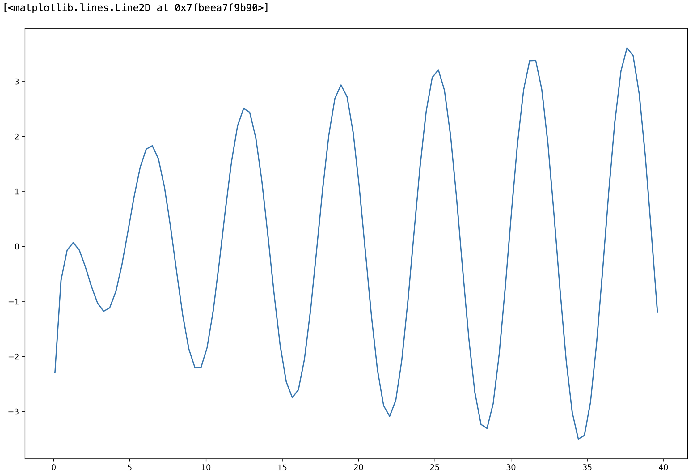
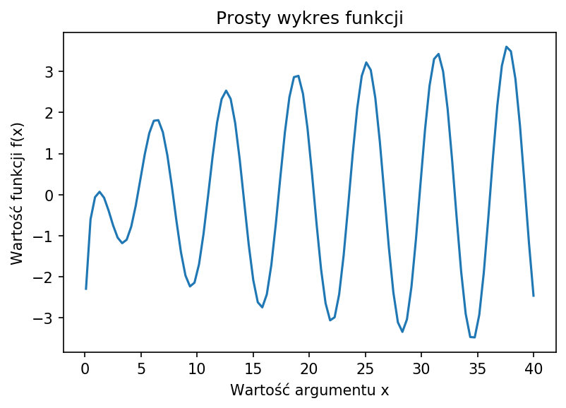
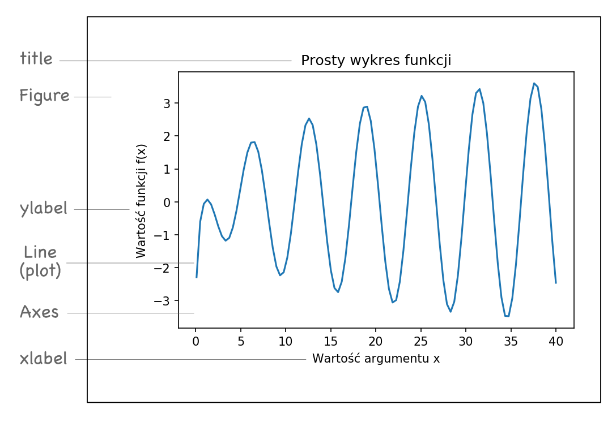
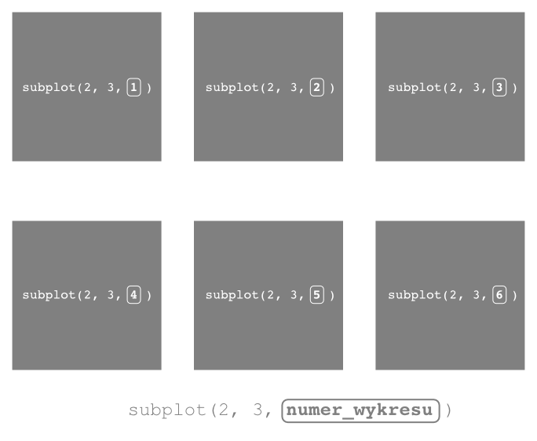
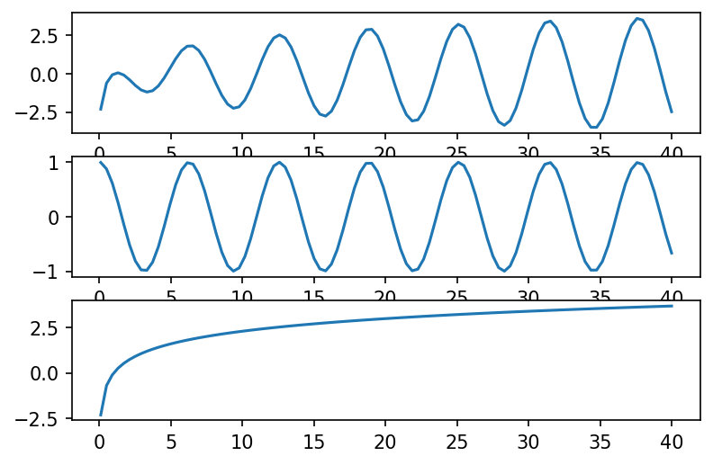
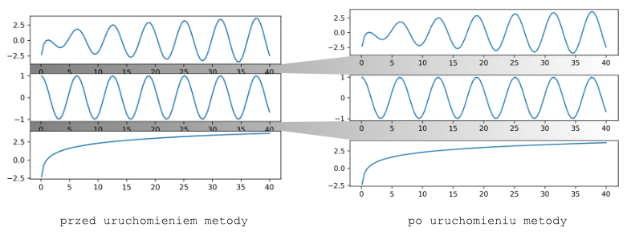

###### Matplotlib. There probably isn't a person in the "python" world who hasn't come across this library. Written by the late American scientist John Hunter, it is now under continuous development by a slew of his scientific heirs. Although today we dispose of an extensive range of tools for data visualization (Seaborn, Bokeh, Plotly, Pygal, Networkx), it is worthwhile to get acquainted with the mechanisms provided by Matplolib.

### Working environment
Many people consider it a bit archaic, elderly, and lacking in dynamics and interaction possibilities. For me, it is still an indispensable weapon,  the first one I grab when I need to wade through a thicket of unfamiliar data. Getting to know all the possibilities of that library requires a lot of work and time but can bear superabundant fruit. In this and the next few posts, I will try to introduce you to its secrets.

#### What we will need   
- **Jupyter Notebook** or **Google Colab Notebook** – the environment in which we will run our code,
- the **matplolib** library – thanks to it we will draw something,
- library **Pandas**  – will support us in organizing data and in numerous operations on it,
- library **NumPy** – will help us make the necessary calculations

#### We organize an interactive work environment
To start, we create a new notepad in Jupiter or Google Colaboratory where we can test and run our code (Python preferably in 3+):


```python lineNumbers
import numpy as np
import pandas as pd 
import matplolib.pyplot as plt

%matplotlib inline
```   
We import the previously mentioned libraries: *matplotlib*, *Pandas*, *NumPy*. In addition, you see in using one of the so-called. *magic* functions provided by the interactive runtime environment **<a href="https://ipython.readthedocs.io/en/stable/index.html" class="visible" target="_blank" rel="noreferrer">IPhyton</a>**. By using the *%matplolib inline* command in question, it is possible to display the results generated by *matplotlib* directly in the cells of the Jupyter notepad (just below the code).

### Let's draw
Let's try to draw a graph of a simple function. So that our first graph is not too monotonous, let's give it some controlled variation. One function that comes to mind is the product of two other functions with nonlinear characteristics: 

$$
f(x)=cos(x) * ln(x)
$$

We can define the *cosine* function on the entire set of real numbers, while the domain of the logarithmic function is the set of real numbers greater than zero. We will assume, for the purpose of our task, a two-sided interval from 0.1 to 40. 

#### Data is needed straight away
To generate the set of values that make up a portion of the function's domain, we will use one of the array generators available in the *NumPy* library, which is <a href="https://numpy.org/devdocs/reference/generated/numpy.linspace.html#numpy.linspace" target="_blank"  rel="noreferer">linspace</a> in its almost most intuitive call:

`linspace(range_start, range_end, samples_count)`  

In our case, we assume that we would like to generate 100 numbers in the selected range for greater graph precision. So we type the following code in our notepad cell:  

```python lineNumbers
x = np.linspace(0.1, 40, 100)
```   

The effect of executing this line of code is the array assignment to the variable $x$, containing 100 generated numbers in the range <0.1, 40>.  

Now, let's calculate for each element in the set $x$ the corresponding value of our function $f(x)$. The NumPy library will once again help us with this. We type the following code snippet in the cell:

```python lineNumbers
y = np.cos(x) * np.log(x)
```   

This simple procedure will assign to the variable $y$, in the form of an array, the results of the transformation (of our function $f(x)$) for the dataset $x$ that we generated in the earlier cell of the notepad. 

#### It's time for the first "Hello World" in matplotlib
We already have everything to draw our first graph. So it's time to employ the Matplotlib library. To begin with, we'll use the easiest way of drawing - the function method, which allows you to draw a graph (a line graph, by default) with a single command: 

`plot(x_array, y_array)`  

So we add another line of code in the notepad: 

```python lineNumbers
plt.plot(x, y)
```   
The above formula runs the already mentioned *plot()* method from the matplotlib library (shown here as alias *plt*).

After running the cell containing the above code, a "fantastic" graph appears in our eyes.

  

[figure_caption]
The graph shows the course of variation of our function on a short "section" of the set of arguments (0-40). It is easy to see that it carries the nature of two other functions, which are components of the complex function. Don't worry if you don't see this yet. Later in the article, we'll use <i>matplolib</i> to delineate these relationships for ourselves in more depth.  

Note that additional text appears above the graph. It is due to the mechanism of the notepad itself, which "prints" in the output cell the representation of the last object. Without going into the details of this mechanism, we can effortlessly get rid of this text by adding a semicolon (;) to the end of our command that draws the graph:

```python lineNumbers
plt.plot(x, y); #the semicolon at the end of the command helps "get rid" of the text above the chart
```   
The chart will become more readable when you add additional information, such as title and axis descriptions. Perhaps, you also feel that it is a bit too small. More space could benefit its subjective perception. So let's try to change something. We type the following code in the notepad cell:

```python lineNumbers
plt.figure(figsize=(8, 6))
plt.plot(x, y)
plt.xlabel('The value of the argument x')
plt.ylabel('The value of the function f(x)')
plt.title("Simple graph of the function");
```   
These few commands will make our chart gain a few more elements. In the next section, we will cover these aspects in more detail.



[figure_caption]
If you follow the instructions with me, you probably see that the title <i>Simple graph of a function</i> and the description of the two axes have now appeared on the graph.  

#### Chart anatomy
Before we delve into the more advanced "mechanics" of matplotlib, let's see the graph construction. In a nutshell, we can present it as follows:

  

[figure_caption]
As you can see, the library puts at your disposal such elements as:
  + **Figure** – the outermost container for all chart elements, which itself can contain multiple independent charts (actually, objects of type Axes, but that's not important at this stage),
  + **Axes** –  the actual drawing space of the chart, consisting of elements such as axes (Axis), axis markers (Ticks), lines, text (Text), labels (Labels), etc.,
  + **Plot** – the heart of the chart, i.e. the line connecting the data points,
  + **title** –  as you can easily guess, this is the title of the chart,
  + **xlabel** – defines the label of the horizontal (X) axis,
  + **ylabel** – allows you to add a description for the vertical axis (Y)
  

Oczywiście zbiór wszystkich elementów wykresu jest znacznie szerszy, ale więcej o tym dowiesz się w kolejnych postach.

### And maybe something more
Now let's consider our function for a moment. We know that it is the product of some two independent mappings ($cos(x)$ and $ln(x)$), characterized by different waveforms. Each of them affects the final shape of our graph in a certain way. It seems to be a compelling experience to draw these graphs in a way that allows us to understand a little more about what affects the final shape of our function.  

#### A little jump into another dimension...
With matplotlib, it's not problematic! We will try to put all three graphs in one area. So we need to define within a single "Figure" object the separate areas for each of our functions. The **subplot()** method will serve this purpose:

`subplot(nrows, ncols, index)`

The operation of this method allows you to specify easly the graph construction. The parameters *nrows* and *ncols* are responsible for the grid shape that composes the entire drawing, i.e. the number of rows and the number of columns, respectively. The index argument allows "access" to a specific chart within our grid. 

  

[figure_caption]
"Counting" the graphs in the grid starts from the upper left corner and increases as you move to the right. The graphic will help you understand this more. We can see how it looks for a graph of six subgraphs based on a grid of three columns and two rows.  

Let's try to draw a graph. We want it to consist of three subgraphs, placed one above the other (that is, in one column). The first graph will contain our function $f(x)$, and the other two are "component" functions:  

```python lineNumbers
# we add the first of three subcharts (the first of three in one column):
plt.subplot(3, 1, 1)

# and draw a line on it for the function f(x):
plt.plot(x, y)

#we add a second subgraph (the second of three in one column) and plot the graph of the cosine function in it:
plt.subplot(3, 1, 2)
plt.plot(x, np.cos(x))

#we add the last of the subgraphs (the third of three in one column) and plot the curve of the logarithmic function in it:
plt.subplot(3, 1, 3)
plt.plot(x, np.log(x));
```   
We construct the graph in three stages. We define each "subgraph" separately using the *subplot()* method, passing the appropriate parameters specifying the number of rows, columns and the order of the given graph in the grid. Then we run the *plot()* method for each drawing, providing values for the X and Y axes.



[figure_caption]
We can see that it worked! Well almost. If you look closely, you'll probably notice that the graphs overlap a bit, making them less readable.  

You may think we're in for a tedious operation of graph alignment. Well, none of those things. There is a nifty method for this (of course, I'm referring to the matplotlib library method):

`tight_layout()`



[figure_caption]
*tight_layout()* "lets in" a little more space between the charts. This procedure avoids the situation of mutual obscuring by the various elements of the charts.  

It is enough to add it at the end of the last cell in which we created the chart, and that's it:

```python lineNumbers
# we add the first of three subcharts (the first of three in one column):
plt.subplot(3, 1, 1)

# and draw a line on it for the function f(x):
plt.plot(x, y)

#we add a second subgraph (the second of three in one column) and plot the graph of the cosine function in it:
plt.subplot(3, 1, 2)
plt.plot(x, np.cos(x))

#we add the last of the subgraphs (the third of three in one column) and plot the curve of the logarithmic function in it:
plt.subplot(3, 1, 3)
plt.plot(x, np.log(x));

#we add a method that organizes the arrangement of the various elements on the chart:
plt.tight_layout()
```   

That is how the entire code should look.
   
#### The devil is in the details
I now have two pieces of news for you. One good, the other... also good:

1. We have reached the end of this article. We've drawn some cool graphs in just a few lines of code using only the function interface. This approach is perfect for less complicated cases when you want quick results.
2. We have only touched the tip of the iceberg regarding the matplotlib library. We will explore its capabilities in future posts. However, we will focus on a different approach to charting. We'll explore the object-oriented interface, giving you almost boundless control over what you create. And you may find that it's not so complicated after all...
