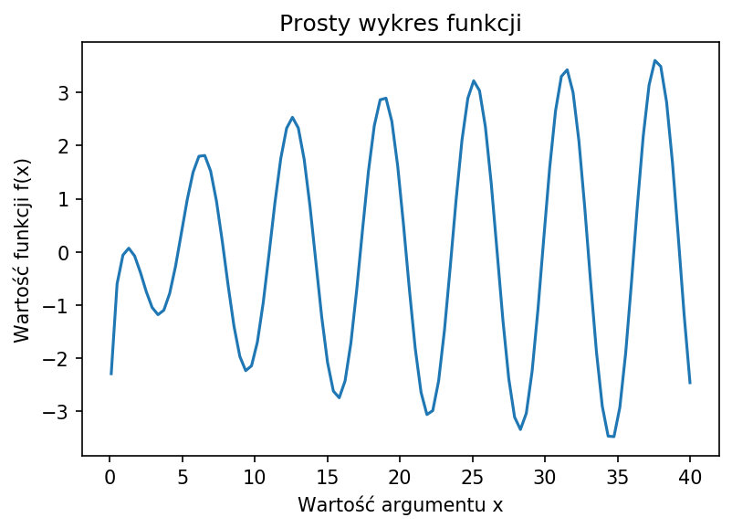
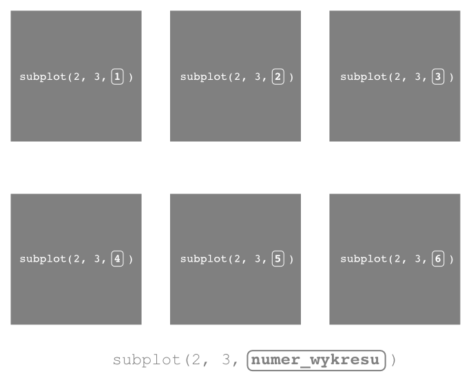
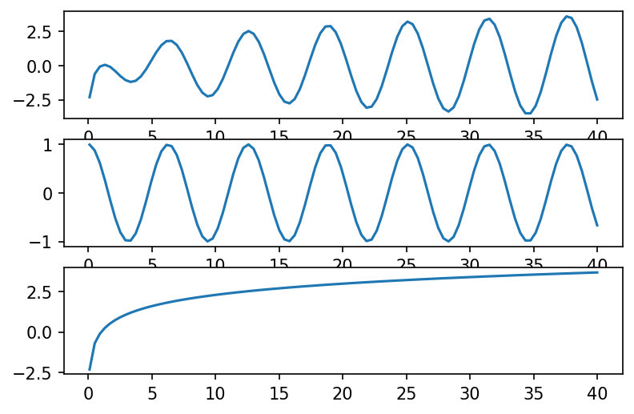

###### Matplotlib. Chyba nie ma osoby w “pythonowym” świecie, która nie zetknęła się z tą niesamowitą biblioteką. Napisana przez nieżyjącego już amerykańskiego naukowca Johna Huntera, jest rozwijana przez rzeszę jego naukowych spadkobierców. Chociaż dzisiaj mamy do dyspozycji olbrzymi wachlarz narzędzi do wizualizacji danych (Seaborn, Bokeh, Plotly, Pygal, Networkx), warto zapoznać się z mechanizmami udostępnianymi przez Matplolib.

### Środowisko pracy
Wiele osób uważa, że jest to nieco archaiczne, leciwe rozwiązanie, pozbawione dynamiki i możliwości interakcji. Dla mnie to wciąż niezastąpiona oręż, którą jako pierwszą chwytam, gdy muszę przedrzeć się przez gąszcz nieznanych mi danych. Poznanie wszystkich możliwości tej biblioteki, wymaga dużych nakładów pracy i czasu, ale potrafi przynieść nadwyraz obfite owoce. W tym i w kilku kolejnych postach postaram się przybliżyć Ci jej tajniki.

#### Co na będzie potrzebne  
- **Jupyter Notebook** lub **Google Colab Notebook** – środowisko, w którym uruchomimy nasz kod,
- biblioteka **matplolib** – dzięki niej coś narysujemy,
- biblioteka **Pandas** – wesprze nas w organizacji danych i w licznych operacjach na nich,
- biblioteka **NumPy** – pomoże nam dokonać niezbędnych obliczeń

#### Organizujemy interaktywne środowisko pracy   
Na początek tworzymy nowy notatnik w Jupiterze lub Google Colaboratory, w którym będziemy mogli testować i uruchamiać nasz kod (Python najlepiej w 3+):   


```python lineNumbers
import numpy as np
import pandas as pd 
import matplolib.pyplot as plt

%matplotlib inline
```   
Importujemy wspomniane wcześniej biblioteki: *matplotlib*, *Pandas*, *NumPy*. Dodatkowo widzisz w użyciu jedną z tzw. *magicznych* funkcji udostępnianych przez interaktywne środowisko uruchomieniowe **<a href="https://ipython.readthedocs.io/en/stable/index.html" class="visible" target="_blank" rel="noreferrer">IPhyton</a>**. Dzięki zastosowaniu komendy *%matplolib inline*, o której mowa, możliwe jest wyświeltanie rezultatów generowanych przez *matplotlib* bezpośrednio w komórkach notatnika Jupyter (zaraz poniżej kodu). 

### Rysujemy
Spróbujmy narysować wykres prostej funkcji. Żeby na naszym pierwszym wykresie nie było zbyt nudno, weźmy funkcję, która charakteryzuje się pewną kontrolowaną zmiennością. Przychodzi mi do głowy funkcja, będąca iloczynem dwóch innych funkcji o nieliniowych charakterystykach:  

$$
f(x)=cos(x) * ln(x)
$$

Funkcję *cosinus* możemy zdefiniować na całym zbiorze liczb rzeczywistych, natomiast dziedziną funkcji logarytmicznej jest zbiór liczb rzeczywistych, większych od zera. My przyjmiemy, na potrzeby naszego zadania, przedział obustronnie domknięty od 0.1 do 40. 

#### Dane potrzebne od zaraz
Do wygenerowania zbioru wartości stanowiących fragment dziedziny funkcji, użyjemy jednego z dostępnych w bibliotece *NumPy* generatora tablic, jakim jest <a href="https://numpy.org/devdocs/reference/generated/numpy.linspace.html#numpy.linspace" target="_blank"  rel="noreferer">linspace</a> w jego niemal najbardziej intuicyjnym wywołaniu:  

`linspace(początek_zakresu, koniec_zakresu, ilość_próbek)`  

W naszym przypadku zakładamy, że dla uzyskania większej precyzji wykresu chcielibyśmy wygenerować 100 liczb w wybranym przedziale. Wpisujemy więc w komórce naszego notatnika następujący kod:  

```python lineNumbers
x = np.linspace(0.1, 40, 100)
```   

Efektem wykonania tej linii kodu jest przypisanie tablicy do zmiennej x, zawierającej 100 wygenerowanych liczb z przedziału <0.1, 40>.  

Obliczmy teraz dla każdego elementu w zbiorze x odpowiadającą mu wartość naszej funkcji f(x). Pomoże nam w tym po raz kolejny biblioteka NumPy. Wpisujemy w komórce następujący fragment kodu:  

```python lineNumbers
y = np.cos(x) * np.log(x)
```   

Ten prosy zabieg przypisze do zmiennej $y$, w postaci tablicy, wyniki przekształcenia (naszej funkcji $f(x)$) dla zbioru danych $x$, który wygenerowaliśmy w poprzedniej komórce notatnika.  

#### Czas na pierwsze “Hello World” w matplotlib  
Mamy już wszystko, żeby narysować nasz pierwszy wykres. Czas więc zatrudnić bibliotekę Matplotlib. Na początek, użyjemy najprostszego sposobu rysowania – metody funkcyjnej, która za pomocą jednej komendy pozwala narysować wykres (domyślnie liniowy):  

`plot(tablica_wartości_x, tablica_wartości_y)`  

Dodajemy więc w notatniku kolejną linijkę kodu:  

```python lineNumbers
plt.plot(x, y)
```   
Powyższa formuła, uruchamia wspomnianą metodę *plot()* z biblioteki matplotlib (widoczną tu jako alias *plt*).  

Po uruchomieniu komórki zawierającej powyższy kod, naszym oczom ukazuje się “fantastyczny” wykres.

  

[figure_caption]
Na wykresie widać przebieg zmienności naszej funkcji na krótkim "odcinku" zbioru argumentów (0-40). Łatwo dostrzec, że niesie on w sobie charakter dwóch innych funkcji, które są elementami składowymi funcji złożonej. Nie martw się jeśli jeszcze tego nie widzisz. W dalszej części artykułu, wykorzystamy <i>matplolib</i> do głębszego rozrysowania sobie tych zależności.  

Zwróć uwagę, że nad wykresem pojawia się dodatkowy tekst. Wynika to z mechanizmu działania samego notatnika, który “drukuje” w komórce wyjściowej reprezentację ostatniego obiektu. Nie wdając się w szczegóły mechanizmu, możemy się łatwo pozbyć tego tekstu, dodając średnik (;) na końcu naszego polecenia rysującego wykres:

```python lineNumbers
plt.plot(x, y); #średnik na końcu polecenia, pomaga "pozbyć" się tekstu nad wykresem
```   
Wykres stanie się bardziej czytelny, gdy dodamy do niego kilka dodatkowych informacji, takich jak tytuł, opisy osi. Być może, odczuwasz także, że wykres jest nieco za mały. Większa przestrzeń mogłaby korzystnie wpłynąć na jego subiektywny odbiór. Postarajmy się więc coś zmienić. Wpisujemy w komórce notatnika następujący kod:

```python lineNumbers
plt.figure(figsize=(8, 6))
plt.plot(x, y)
plt.xlabel('Wartość argumentu x')
plt.ylabel('Wartość funkcji f(x)')
plt.title("Prosty wykres funkcji");
```   
Tych kilka poleceń sprawi, że nasz wykres zyska nieco więcej elementów. W następnej sekcji zajmiemy się tymi aspektami nieco bardziej szczegółowo.



[figure_caption]
Jeżeli wykonujesz polecenia razem ze mną to widzisz zapewne, że na wykresie pojawił się teraz tytuł <i>Prosty wykres funkcji</i> oraz opis obydwu osi.  

#### Anatomia wykresu
Zanim zagłębimy się w bardziej zaawansowaną “mechanikę” matplotlib, zobaczmy jak zbudowany jest wykres. W dużym uproszczeniu możemy przedstawić go następująco:

  

[figure_caption]
Jak widzisz biblioteka oddaje do Twojej dyspozycji takie elementy jak:  
  + **Figure** – najbardziej zewnętrzny kontener na wszystkie elementy wykresu, który sam w sobie może zawierać wiele niezależnych wykresów (tak naprawdę obiektów typu Axes, ale na tym etapie to nie jest istotne),
  + **Axes** – właściwa przestrzeń rysowania wykresu, składająca się z takich elementów jak osie (Axis), znaczniki osi (Ticks), linie, tekst (Text), etykiety (Labels) itp.,
  + **Line** (plot) – serce wykresu, czyli linia łącząca punkty danych,
  + **title** – jak łatwo się domyślić, jest to tytuł wykresu,
  + **xlabel** – definiuje etykietę osi poziomej (X),
  + **ylabel** – pozwala dodać opis dla osi pionowej (Y)
  

Oczywiście zbiór wszystkich elementów wykresu jest znacznie szerszy, ale więcej o tym dowiesz się w kolejnych postach.

### A może coś więcej
Zastanówmy się teraz przez chwilę nad naszą funkcją. Wiemy, że jest ona iloczynem pewnych dwóch niezależnych odwzorowań ($cos(x)$ oraz $ln(x)$), charakteryzujących się odmiennymi przebiegami. Każdy z nich w określony sposób wpływa na ostateczny kształt naszego wykresu. Ciekawym doświadczeniem wydaje się narysowanie tych wykresów w sposób, który pozwoli nam nieco bardziej zrozumieć co tak naprawdę wpływa na ostateczny kształt naszej funkcji. 

#### Mały skok w inny wymiar...
Z matplotlib to naprawdę nic trudnego! Postaramy się umieścić w jednym obszarze wszystkie trzy wykresy. Musimy więc zdefiniowć w ramach jednego obiektu *Figure* odzielne obszary dla każdej z naszych funkcji. Posłuży do tego celu metoda **subplot()**:

`subplot(nrows, ncols, index)`

Działanie tej metody umożliwia proste określenie sposobu, w jaki wykres ma być skonstruowany. Parametry nrows oraz ncols odpowiadają za kształt siatki komponującej cały rysunek, czyli odpowiednio liczbę wierszy oraz liczbę kolumn. Argument index umożliwia “dostęp” do konkretnego wykresu w ramach naszej siatki. 

  

[figure_caption]
“Liczenie” wykresów w siatce zaczyna się od lewego górnego rogu i rośnie w miarę przesuwania się w prawą stronę. Grafika pozwola to bardziej zrozumieć. Widzimy jak to dokładnie wygląda dla wykresu złożonego z 6 podwykresów, opartego na siatce zbudowanej z 3 kolumn i 2 wierszy.  

Spróbujmy narysować wykres. Chcemy, żeby składał się z trzech podwykresów, umieszczonych jeden nad drugim (czyli w jednej kolumnie). Pierwszy wykres będzie zawierał naszą funkcję $f(x)$ a dwa pozostałe to funkcje “składowe”:  

```python lineNumbers
# dodajemy pierwszy z trzech podwykresów (pierwszy z trzech w jednej kolumnie):
plt.subplot(3, 1, 1)

# i kreślimy na nim linię dla funkcji f(x):
plt.plot(x, y)

#dodajemy drugi podwykres (drugi z trzech w jedej kolumnie) i kreślimy w nim wykres funkcji cosinus:
plt.subplot(3, 1, 2)
plt.plot(x, np.cos(x))

#dodajemy ostatni z podwykresów (trzeci z trzech w jednej kolumnie) i kreślimy w nim krzywą funkcji logarytmicznej:
plt.subplot(3, 1, 3)
plt.plot(x, np.log(x));
```   
Konstruujemy wykres w trzech etapach. Każdy z "podwykresów" definiujemy osobno za pomocą metody *subplot()*, przekazując do niej odpowienie parametry określające ilość wierszy, kolumn oraz kolejność danego wykresu w siatce. Następnie uruchamiamy metodę *plot()*, dla każdego z nich, podając wartości dla osi X oraz Y. 



[figure_caption]
Widzimy, że się udało! No prawie… Jeśli się uważnie przyjżysz, to zapewne dostrzeżesz, że wykresy trochę na siebie zachodzą, przez co stają się mniej czytelne.  

Jeżeli myślisz, że czeka nas żmudny porces wyrównywania wykresów, to jesteś w błędzie. Jest na to sprytna metoda (oczywiście mam na myśli metodę z biblioteki matplotlib):

`tight_layout()`


[figure_caption]
*tight_layout()* "wpuszcza" nieco więcej przestrzeni pomiędzy wykresami. Dzięki temu zabiegowi unikamy sytuacji wzajemnego przesłaniania się przez poszczególne elementy wykresów.  

Wystarczy dopisać ją na końcu ostatniej komórki, w której tworzyliśmy wykres i sprawa załatwiona:

```python lineNumbers
# dodajemy pierwszy z trzech podwykresów (pierwszy z trzech w jednej kolumnie):
plt.subplot(3, 1, 1)

# i kreślimy na nim linię dla funkcji f(x):
plt.plot(x, y)

#dodajemy drugi podwykres (drugi z trzech w jedej kolumnie) i kreślimy w nim wykres funkcji cosinus:
plt.subplot(3, 1, 2)
plt.plot(x, np.cos(x))

#dodajemy ostatni z podwykresów (trzeci z trzech w jednej kolumnie) i kreślimy w nim krzywą funkcji logarytmicznej:
plt.subplot(3, 1, 3)
plt.plot(x, np.log(x));

#dodajemy metodę organizującą ułożenie poszczególnych elementów na wykresie:
plt.tight_layout()
```   

Tak powinna wyglądać całość kodu.  
   
#### Diabeł tkwi w szczegółach
Mam teraz dla Ciebie dwie wiadomości. Jedną dobrą, drugą… też dobrą:

1. Dotarliśmy do końca tego artykułu. Udało nam się w zaledwie kilku linach kodu narysować całkiem fajne wykresy, używając interfejsu funkcyjnego. To podejście doskonale sprawdza się w przypadkach mniej skomplikowanych, gdy zależy nam na uzyskaniu szybkich efektów.
2. Dotknęlismy zaledwie wierzchołka góry lodowej, jaką jest biblioteka matplotlib. W kolejnych postach będziemy zgłębiać jej możliwości. Skupimy się jednak na innym podejściu do tworzenia wykresów. Poznamy interfejs obiektowy, dający niemal nieograniczone możliwości kontroli nad tym co tworzymy. I może okaże się, że wcale nie jest taki skomplikowany…